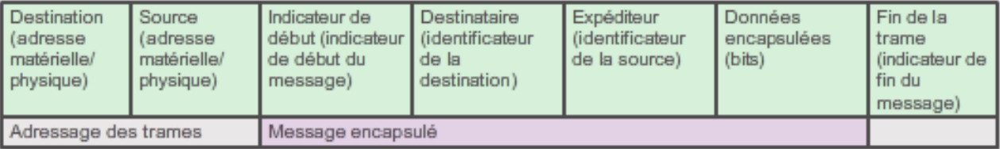
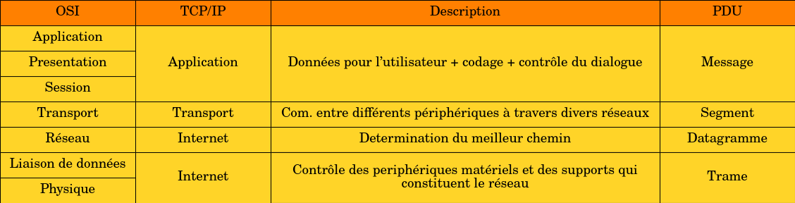
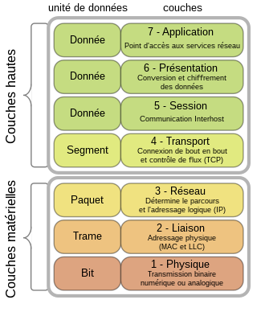
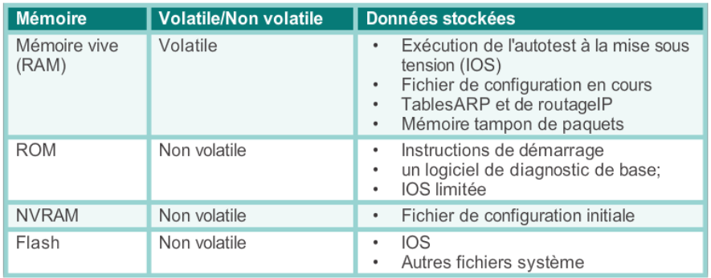
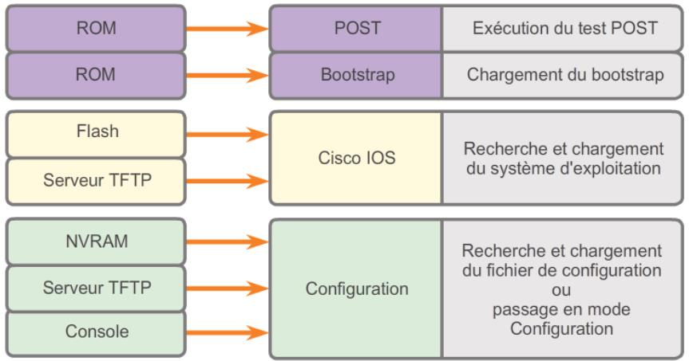

# Sythèse de théorie de télécommunications et réseaux 🖧
## Chapitre 0 : Table des matières 

0. [Chapitre 0 : Table des matières](#0)
1. [Introduction et généralités](#1)
2. [Communication et protocoles réseaux](#2)
3. [Accès réseau](#3)
4. [Ethernet](#4)
5. [Système d'exploitation de réseau](#5)
5. [Couche réseau](#6)
5. [Couche transport](#7)
5. [Adressage IP](#8)
5. [Découpage réseau](#9)
5. [La couche application](#10)

## Chapitre 1 : Introduction et généralités 

### Rôles de l'administrateur

L'admin gère :
* Les besoins, budget et priorités
* Les ordinateurs et périphériques
* Les performances des systèmes
* Les utilisateurs
* Les fichiers et disques
* Les services
* Les problèmes
* Les sauvegardes et stockage des données
* Le réseau
* La sécurité

### Methodologie de l'administrateur

### Conversion de nombres dans d'autres bases

1) 10 en base 2    
  
      | 2^x | 2^10 | 2^9 | 2^8 | 2^7 | 2^6 | 2^5 | 2^4 | 2^3 | 2^2 | 2^1 | 2^0 |
      | ---  | ---- | --- |---  | ---- | --- |---  | ---- | --- |---  | ---- | --- |
      | Base 10 | 1024 | 512 | 256 | 128 | 64 | 32 | 16 | 8 | 4 | 2 | 1 |
  
    * Si le nombre à convertir est plus petit que la valeur du tableau, on note un zero sous la case
    * Si le nombre à convertir est plus grand que la valeur du tableau, on note un un, on soustrait la valeur au nombre à convertir et on continue le processus.
  
2) 2 en base 10
  
      | 2^x | 2^10 | 2^9 | 2^8 | 2^7 | 2^6 | 2^5 | 2^4 | 2^3 | 2^2 | 2^1 | 2^0 |
      | ---  | ---- | --- |---  | ---- | --- |---  | ---- | --- |---  | ---- | --- |
      | Base 10 | 1024 | 512 | 256 | 128 | 64 | 32 | 16 | 8 | 4 | 2 | 1 |
      | Base 2 |  |  |  |  |  |  |  |  |  |  |  |

    * On note le nombre en base 2 en partant de la droite, puis on additionne les nombres en base 10 qui sont face à un 1
      
4) 2 en base 8
5) 2 en base 16
6) 8 en base 2
7) 10 en base 8 ou 16

### Les réseaux 

>un réseau est un ensemble d'équipements et de logiciels qui permettent d'acheminer de l'information d'un émetteur jusqu'à un ou plusieurs récepteurs

Deux critères pour les catégoriser :
* Etendue du réseau
    * PAN (personal area network) ex : bluetooth
    * LAN (local area network)
    * MAN (metropolitan area network)
    * WAN (wide area network)
* Technologie du réseau     
    Topologie physique
    * Diffusion (support de transmission partagé par tous les équipements). On y retrouve BUS et ANNEAU.
        * Dans le cas ou le message est destiné à tous les équipements on a une diffusion générale (broadcast).

    * Point à point (un seul support de transmission reliant une paire d'équipements seulement). On y retrouve POINT A POINT, ETOILE, MAILLÉE
        * Le point à point entre un expediteur et un destinataire est une diffusion individuelle (unicast).

    En général la topologie représente la disposition physique des composants, mais il existe aussi la topologie logique qui est la manière dont les stations se partagent le support et dépend de la methode d'accès au réseau.

    On retrouve dans les topologies logiques :
    * Ethernet
        * Repose sur une topologie de type bus linéaire
        * protocole CSMA/CD (Carrier Sense Multiple Access
with Collision Detection)
    * Token ring
        * Seul le poste ayant le jeton peut transmettre sur le réseau
        * Si un poste veut émettre, il doit attendre jusqu'à ce qu'il ait le jeton
        * Topologie en anneau
    * FDDI (fiber distributed data interface)
        * Fibre optique
        * Anneaux primaire et secondaire (pour rattrapage d'erreurs)

### Modes de fonctionnement 

> Tous les ordinateurs connectés à un réseau et qui participent directement aux communications
réseau s’appellent des hôtes ou des périphériques finaux

## Chapitre 2 : Communication et protocoles réseaux 

### Protocoles

>Un protocole est une suite de règles qui visent à ce qu'un message soit correctement transmis et compris.

Organisé en couches

### Codage d'un message 

>Un codage est le processus de conversion des informations vers un autre format acceptable, à des fins de transmission.

Un message est :
1) Codé en bits 
2) Converti en en impulsions électriques / ondes lumineuses

### Encapsulation / désencapsulation

>L'encapsulation est un processus permettant d'encapsuler un message dans une trame.

La trame contient :
* L'adresse source
* L'adresse de destination
* Les données encapsulées

Désencapsuler c'est extraire ces données.

### Taille

Si le message est grand, on le découpe en plusieurs trames.

### Synchronisation

* Methode d'accès
  >moment où un individu peut envoyer un message.

* Contrôle de flux
  >négocier une synchronisation correcte en vue d'établir une communication.

* Délai d'attente de la réponse
  >Les hôtes du réseau sont également soumis à des règles qui spécifient le délai d'attente des réponses et l'action à entreprendre en cas de dépassement du délai d'attente.

Options de remise des messages

* Monodiffusion
* Diffusion
* Multidiffusion
  

### Acronymes

<ins>Couche application</ins>

* DNS (Domain Name System)  
  * Nom de domaine -> Adresse IP
* DHCP (Dynamic Host Configuration Protocol)    
  * Attribution dynamique d'addresses IP aux stations clientes au démarrage
* SMTP (Simple Mail Transfer Protocol)  
  Permet aux terminaux d’envoyer un mail à un serveur de messagerie
* POP (Post Office Protocol)  
  * Permet aux clients de récupérer ou de télécharger des emails d’un serveur de messagerie
* IMAP (Internet Message Access Protocol)   
  * Permet aux clients d’accéder aux emails stockés sur un serveur de messagerie
* FTP (File Transfert Protocol) 
  * Permet à un hôte d’accéder à des fichiers sur un autre hôte du réseau
  * Transférer des fichiers vers un autre hôte du réseau
* TFTP (Trivial File Transfert Protocol)
  * Version simplifiée de FTP, pas d’authentification
* HTTP (HyperText Transfert Protocol)   
  * Permet d’échanger du texte ou des fichiers multimédia sur le web

<ins>Couche transport</ins>
   
* UDP (User Datagram Protocol)
  * Permet à un processus exécuté sur un hôte d’envoyer des paquets à un processus exécuté sur un autre hôte
  * Sans connexion  au préalable 
  * Sans confirmation de la transmission de datagrammes
* TCP (Transmission Control Protocol)
  * Au contraire d’UDP, permet une connexion fiable entre les processus s’exécutant sur des hôtes distincts

<ins>Couche internet</ins>

* IP (Internet Protocol)
  * Permet de recevoir des segments de message de la couche transport. 
  * Il regroupe les messages en paquets et indique leur adresse pour permettre leur acheminement de bout en bout sur un interréseau
* NAT (Network Address Translation)
  * Permet de convertir les adresses IP d’un réseau privé en adresses IP globales et publiques
* ICMP (Internet Control Message Protocol)
  * Permet à l’hôte de destination de signaler à l’hôte source des erreurs liées aux transmissions de paquets
* OSPF (Open Shortest Path First)
  * Protocole de routage à états de liens permettant de faire du routage dynamique
* EIGRP (Enhanced Interior Gateway Routing Protocol)
  * Protocole de routage dynamique propriétaire de Cisco

<ins>Protocoles de la couche réseau</ins>

* ARP (Address Resolution Protocol)
  * Fournit un mappage dynamique entre une adresse logique (IP) et une adresse physique (MAC)
* PPP (Point to Point Protocol)
  * Permet d’encapsuler des paquets pour les transmettre via une connexion en série

### Modèles de référence 

Le modèle OSI est un modèle en 7 couches :

* 2 couches basses : dédiées à l’infrastructure des réseaux
* 2 couches moyennes : servant au contrôle du transport de l’information
* 3 couches hautes : liées à la gestion de l’application

## Chapitre 3 : Accès réseau 

## Chapitre 4 : Ethernet 

### Ethernet

* Au niveau de la couche liaison de donnée et couche physique
* Norme IEE 802.2 / 802.3 
* 10 Mb/s -> 10 Gb/s

### Couche liaison de donnée

* Sous-couche LLC Ethernet

    Gère la communication entre les couches supérieures et inférieures.
* Sous-couche MAC Ethernet

    Elle encapsule les données et contrôle l'accès au support

### Adresse MAC

## Chapitre 5 : Système d'exploitation réseau 

## Chapitre 6 : Couche réseau (OSI3) 

### La couche réseau

> Elle fournit des services permettant aux périphériques finaux d'échanger des données sur le réseau.

Elle compte 4 processus de base :

1) Adressage
    * Identification de manière unique du périphérique présent sur le réseau, pour acheminer les données via IPv4 ou IPv6

2) Encapsulation
    * La couche 3 recoit l'unité de données de protocole (segment/datagramme) de la couche 4
    * Ajout d'une en-tête de de couche 3
    * l'unité de données de protocole de la couche 3 est un paquet

3) Routage
    * Les paquets doivent circuler à travers des periphériques intermédiaires
    * Periphériques intermédiaires = "routeurs"
    * Chemin emprunté par un paquet entre deux périphériques consécutifs = "un saut"

4) Désencapsulation
    * Valable si le paquet a atteint le périphérique cible
    * Desencapsulation
    * Transmission de l'unité de donnée de protocole à la couche 4 Transport

### Caractéristiques du protocole IP 

Il a été conçu pour ne pas surcharger les réseaux. Il fournit uniquement les fonctions requises pour transférer un paquet d’une source à une destination en passant par un système interconnecté de réseaux.

* Aucune connexion n'est établie avant l'envoi de paquets de données
* Acheminement non fiable: aucune surchage n'est utilisée pour garantir la transmission des paquets
* Indépendant du support: fonctionne indépendamment du support transportant les
données
* Il est qualifié de protocole "non fiable" car il ne sait pas gérer les paquets
endommagés ou non remis
* Il n'y a pas de champs requis pour la transmission fiable dans l'en-tête d'un
paquet IP mais cela offre moins de surcharge
* On ne sait donc pas si le destinataire est sur le réseau, si le paquet est bien arrivé
à destination et si le destinataire peut lire le paquet
* Le destinataire ne sait pas quand le paquet arrive

:warning: La taille maximale d'unité de données de protocole que chaque support peut
transporter est déterminé au niveau de la couche de liaison
de données et est transmise à la couche réseau. Donc la taille de création des
paquets est déterminée.

### IPv4

Un paquet IPv4 comporte deux parties
1) En-tête IP -> indique les caractéristiques du paquet
2) Données utiles -> contient les info. du segment de couche 4 et les données en elles-mêmes

> "Time To Live" = valeur pour limiter la durée de vie d'un paquet. Elle est indiquée en secondes mais généralement appelée "nombre de
sauts". Si cette valeur est dépassée, le routeur rejette le paquet et envoie un message de dépassement de délai ICMP à la source.

### IPv6

Les problèmes de l'IPv4 ont conduit au développement de l'IPv6
Espace d'adressage plus important (beaucoup beaucoup + d'adresses IP,
environs 67 milliards par cm^2 de surface terrestre, ui c bcp)
* Traitement des paquets plus efficace => l'en-tête IPv6 a été simplifiée et comporte moins de champs
* Traduction d'adresses réseau non nécessaire => comme y'a beaucoup d'IP, plus besoin de NAT
* Sécurité intégrée => prend en charge les fonctions d'authentification et de confidentialité (pas comme l'IPv4)

### Routeur

Equipement intermédiaire opérant au niveau de la couche 3 du modèle OSI, il envoie
et recevoir des paquets IP qui lui sont destinés
Chaque interface du routeur est un membre ou un hôté d'un réseau IP différent
/!\ Deux interfaces actives ne peuvent pas appartenir au même réseau
Ils nécessitent:
* Un OS
* Un processeur 
* De la mémoire vive => contient l'IOS, fichier de config « running-config », table de
routage IP, Cache ARP, Mémoire tampon
/ !\ Mémoire volatile, perd son contenu lors mise hors tension.
* De la mémoire morte => instructions de démarrage, le POST (Power On Self
Test, pour savoir si tout va bien), une version limitée (de merde) de l'IOS

La mémoire vive non volatile est utilisé par IOS comme stockage permanent pour le
fichier startup-config
La mémoire Flash est une mémoire non volative utilisée comme stockage permanent
pour l'IOS et d'autres fichier associés au système, il y est copié de la mémoire
Flash vers la mémoire vive lors du démarrage

Etapes lors du démarrage:
● Exécution du POST et chargement du bootstrap (ROM)
● Localisation et chargement de l'IOS (Flash ou TFTP)
● Localisation et chargemetn du fichier de config initiale (NVRAM, TFTP ou Console)

## Chapitre 7 : Couche transport 

## Chapitre 8 : Adressage IP 

## Chapitre 9 : Découpage réseau 

## Chapitre 10 : Couche Application 

