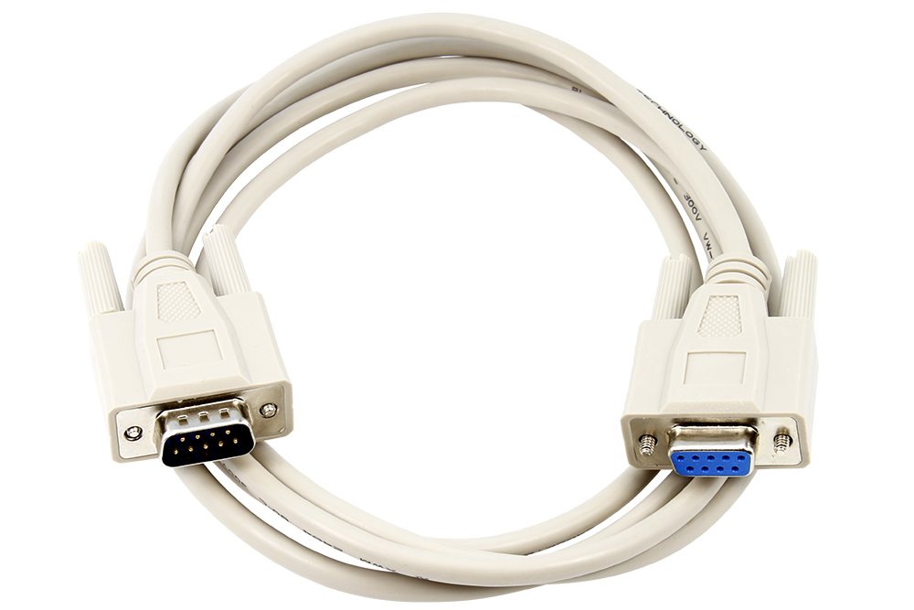
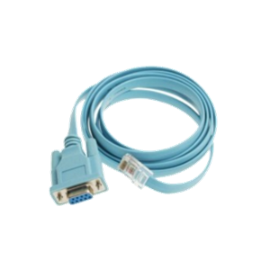
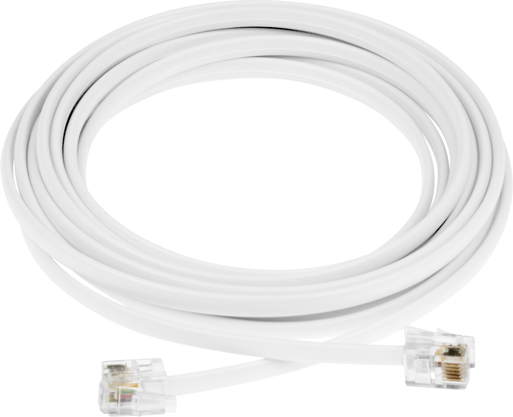
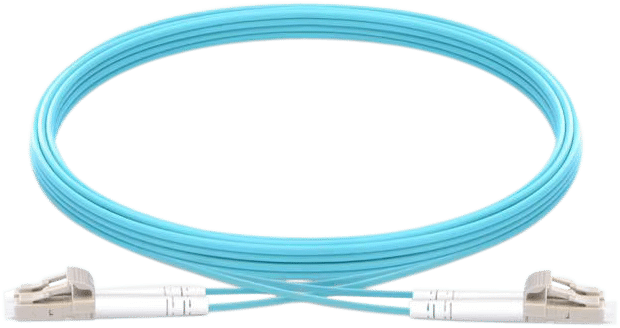
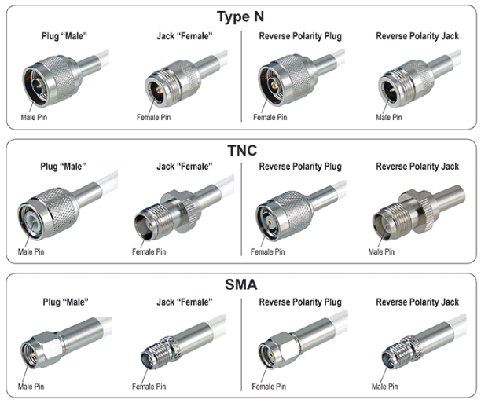

# Câbles

## Série

- Un ensemble de câbles et de connecteurs différents dont l'objectif est d'établir une connexion série.

## Console

- Un câble série souvent utilisé pour connecter un ordinateur avec un appareil réseau pour le configurer.

- Connecteurs pour l'ordinateur : RJ-45, USB, ...
- Connecteurs pour l'appareil réseau : série, ...

## Câbles téléphoniques

- Câbles qui servaient à faire transiter les appels téléphoniques.

- Connecteurs : RJ-11, ...

## Fibres optiques

- Câbles de connexion très rapides, efficaces sur de longues distances, souvent utilisés pour les réseaux WAN ou les data centers.

- Connecteurs : pleins

- Protocole : Ethernet

## Câbles coaxiaux

- Souvent utilisés pour le transfert de signaux électriques à haute fréquence.

- Connecteurs : pleins

