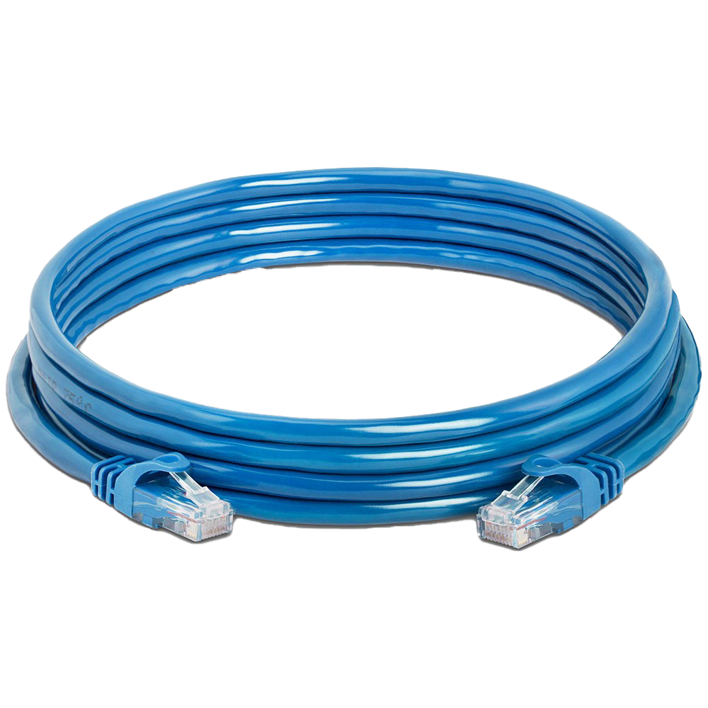
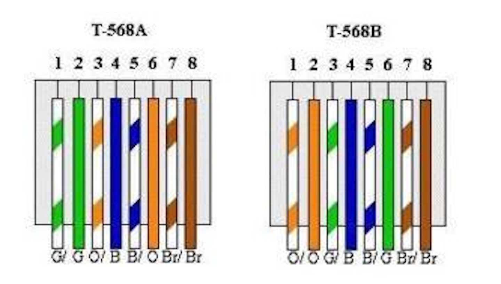
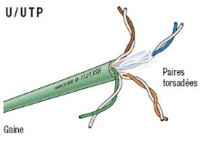
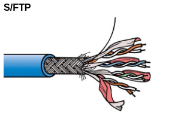
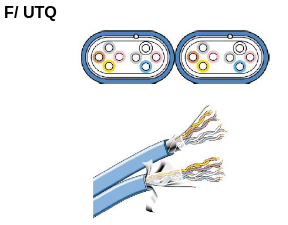

# Cable Ethernet

## Image d'un cable Ethernet

## Normes de câblage
Les normes de câblage sont EIA/TIA-568.

- T-568A : G/ G O/ B B/ O Br/ Br
- T-568B : O/ O G/ B B/ G Br/ Br

Câbles Ethernet croisés :
- T-568A & T-568B

Câbles Ethernet droits :
- 2x T-568B

## Types de cables Ethernet.

### U/UTP

Unshielded / Unshielded Twisted Pairs

- Paires torsadées non blindées

### F/UTP

Foiled / Unshielded Twisted Pairs

- Paires torsadées non blindées
- Écran global

### U/FTP

Unshielded / Foiled Twisted Pairs

- Paires torsadées non blindées
- Un écran par paires

### F/FTP

Foiled / Foiled Twisted Pairs

- Paires torsadées non blindées
- Écran global
- Un écran par paires

### S/FTP

Shielded / Foiled Twisted Pairs

- Paires torsadées blindées
- Tresse générale
- Un écran par paires

### F/UTQ

Foiled / Unshielded Twisted Quad

- Paires torsadées non blindées
- Écran global
- Structure en quadruples

## Categorie des cables Ethernet.

... (savoir sauf freque, reternir les normes (chiffres))

| Categorie | Description                    |
| 3         | Téléphonie, obsolète           |
| 5e ou 5   | Bande passante, 1Gb/s          |
| 6         | Bande passante, categorie 5    |
| 6a        | Bande passante, 10G/s sur 100m |
| 7         | Bande passante, min S/FTP      |

## Longeur moyenne

- 100m
- 70-90m en pratique.

## Choses à ne pas faire

### Risque de casser le câble

- Plier trop le câble.
- Serrer trop fort le câble.
- Appliquer une torsion excessive sur le câble.
- Faire supporter un poids excessif par le câble.

### Risque d'interférence

- Ne pas placer le câble trop près de sources électriques/électromagnétiques.

## Construire un câble UTP

### Outils

- Pince coupante
- Pince à dénuder
- Pince à sertir RJ-45
- Testeur de câble

### Matériel

- Câble UTP sans connecteurs
- 2 embouts RJ-45
- 2 connecteurs RJ-45

### Manipulation

1. Mettre l'embout.
2. Dénuder le câble sur 2-3 cm.
3. Aligner les petits câbles en T-568A ou B.
4. Mettre le connecteur RJ-45.
5. Sertir.
6. Répéter de l'autre côté.
7. Tester le câble.