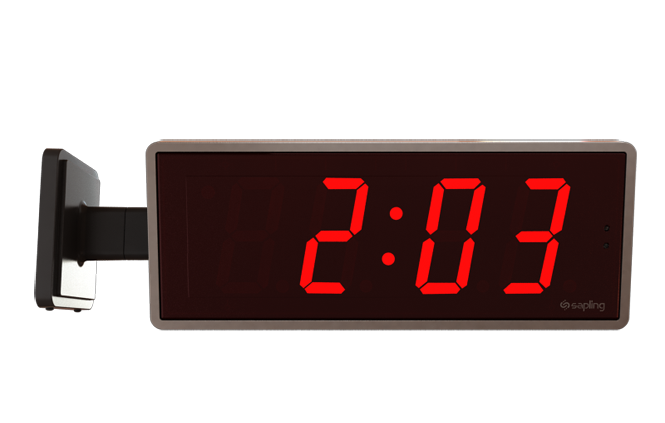

# Différences entre le numérique et l'analogique

### Analogique

- La valeur change en permanence avec une précision "infinie".

Exemple : une horloge analogique. Vous pouvez zoomer à l'infini si vous souhaitez des nombres plus précis.

### Numérique

- Les valeurs sont précises, et il y a une limite à la précision.

Exemple : une horloge numérique. Il n'y a pas de 2:03:xx:xx:...

Exemple : binaire, il n'y a pas de 0.5, seulement 1 ou 0.

101010111010100001010
