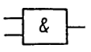
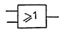

# Opérateurs logiques

### NON

- Une entrée $A$ renvoie l'opposé de A.

- Notation : $\overline{A} = ....$

#### Représentation :
| USA | Europe |
| --- | ------ |
|  |  |

---

### ET

- Deux entrées $A, B$, si les deux entrées sont vraies, alors la sortie est vraie.

- Notation : $A.B = ...$

#### Représentation :
| USA | Europe |
| --- | ------ |
|  |  |

---

### OU / OU inclusif

- Deux entrées $A, B$, si l'une ou les deux entrées sont vraies, alors la sortie est vraie.

- Notation : $A+B = ...$

#### Représentation :

| USA | Europe |
| --- | ------ |
|  |  |

---

### NON ET

- Deux entrées $A, B$, si les deux entrées ne sont pas actives en même temps, alors la sortie est vraie.

- Notations : $\overline{A.B}$ ou  $\overline{A} + \overline{B}$

#### Représentation
| USA | Europe |
| --- | ------ |
|  |  |

---

### NON OU

- Deux entrées $A, B$, si aucune des entrées n'est vraie, alors la sortie est vraie.

- Notations : $\overline{A+B}$ ou $\overline{A}.\overline{B}$

#### Représentation
| USA | Europe |
| --- | ------ |
|  |  |

---

### OU exclusif

- Deux entrées $A, B$, si l'une des deux entrées est vraie, alors la sortie est vraie.

- Notations : $A⊕B$ ou $A.\overline{B} + \overline{A}.B$ 

#### Représentation
| USA | Europe |
| --- | ------ |
|  |  |

---

### NON OU exclusif / Égalité

- Deux entrées $A, B$, si A == B, alors la sortie est vraie.

- Notations : $\overline{A⊕B}$ ou $\overline{A.B} + A.B$

| USA | Europe |
| --- | ------ |
|  |  |