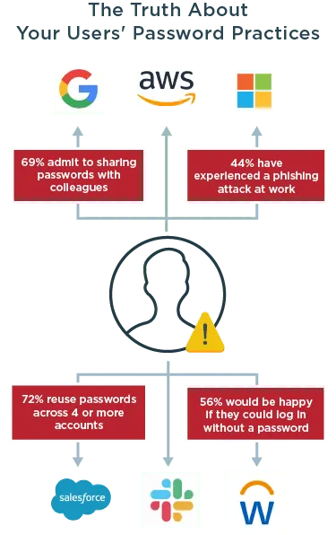

# Comparaison entre Chiffrement, ‘Hashing’ et ‘Salting’ - Quelle sont les différences ?
1 mars 2022
6-minutes de lecture
Andrew Hughes

Sécurité des identités 

Introduction

Le chiffrement et le ‘hashing’ sont des concepts fondamentaux en informatique, pour tout type de « secret », mais vous ne savez sans doute pas à quel point ils le sont. Dans le cadre de cet article, nous allons nous intéresser au chiffrement, au ‘hashing’ et au ‘salting’ des mots de passe. Les mots de passe constituent la méthode d’authentification pour se connecter la moins sécurisée, mais ils sont toujours largement utilisés. Les acteurs malveillants peuvent exploiter des identifiants compromis pour des attaques de type vol de données, fraude par usurpation de compte, ransomware et autres activités criminelles.

 

Le ‘hashing’ et le chiffrement sont deux méthodes de sécurisation des données, mais ils ont deux fonctions différentes. Le chiffrement d’un mot de passe est utilisé lorsque le texte en clair doit être récupéré pour une raison quelconque. Le ‘hashing’ d’un mot de passe est typiquement utilisé du côté du serveur lorsque ses opérateurs n’ont pas besoin de connaître le texte en clair, mais juste de démontrer que l’utilisateur le connaît. Ces fonctions ont lieu en arrière-plan, comme pour le salage, sans ajouter de friction à l’expérience utilisateur.

 

Les entreprises qui doivent utiliser des mots de passe devraient toujours avoir recours à des outils cryptographiques pour garder les mots de passe en sécurité plutôt que d’essayer de créer entièrement leurs propres outils. Poursuivez la lecture pour en savoir plus sur le chiffrement, le hachage et le salage, et sur leur utilisation.
Le chiffrement, c’est quoi ?

Le chiffrement est une méthode utilisée pour sécuriser les mots de passe (plaintext) en les convertissant, avec une formule mathématique, en une version codée (ciphertext). Le chiffrement est à double sens, ce qui signifie que le mot de passe original en plaintext qui est chiffré en ciphertext peut être remis en plaintext si on le déchiffre. Certains systèmes d’authentification demandent toujours des mots de passe réversibles. Toute personne ayant la bonne clé de chiffrement peut prendre le ciphertext et le renverser pour révéler les mots en passe en plaintext et les rendre moins sûrs. Il est essentiel de protéger les clés de chiffrement étant donné qu’un acteur malveillant détenant la clé peut déverrouiller le chiffrement pour récupérer les mots de passe. Un module de sécurité physique (HSM - hardware security module) peut réaliser des opérations centrales de cryptographie et stocker les clés de manière à empêcher qu’elles soient extraites du HSM.

 

Le chiffrement peut jouer un rôle important dans le stockage des mots de passe, et plusieurs algorithmes et techniques cryptographiques sont disponibles. Par exemple, les responsables des mots de passe utilisent le chiffrement pour protéger la confidentialité des secrets stockés. Lorsqu’un utilisateur a besoin d’un mot de passe, le responsable du mot de passe déchiffre le ciphertext et insère ce mot en passe en plaintext dans le formulaire du navigateur web car le plaintext est le seul format autorisé par le navigateur.
Le hachage, c’est quoi ?

Le hachage utilise également un algorithme pour transformer en ciphertext un mot de passe en plaintext, et masquer ainsi le vrai mot de passe. Contrairement au chiffrement, le hachage est à sens unique. Si vous prenez un mot de passe quelconque d’une certaine longueur, que vous le soumettez à un algorithme de hachage, il en ressort une chaîne ou un nombre hexadécimal qui est unique au plaintext ayant été fourni. La longueur dépend de l’algorithme utilisé. Les mots de passes hachés ne peuvent plus être retransformés en mot de passe en plaintext original.

 

Le serveur stocke une version hachée du mot de passe. Lorsque l’utilisateur tape un mot de passe en plaintext, le système calcule le hachage et compare les hachages. Si ce sont les mêmes, le serveur peut confirmer le mot de passe et l’utilisateur obtient l’accès demandé.

 
Algorithmes de hachage courants

 

Algorithmes de hachage moins sécurisés :

* Le message-digest algorithm 5 (MD5) prend un message d’une certaine longueur comme élément entrant, le convertit en élément sortant d’une d’une valeur hachée fixe de 128 bits à utiliser pour authentifier le message original.

* Le SHA (secure hash algorithm) est également une fonction de hachage cryptographique. Les valeurs SHA-1 de 160 bits sont plus sécurisées que les valeurs de hachage de 128 bits du MD5, mais présentent aussi des faiblesses qui ont conduit à la famille de code de hachage SHA-2.

Algorithmes de hachage plus sécurisés :

* La famille de code de hachage SHA-2 est actuellement très utilisée, avec des algorithmes qui sont plus longs et plus difficiles à casser. Le nom des algorithmes SHA-2 est lié à leur longueur, ainsi le SHA-224 correspond à une longueur de 224 bits. Le même format fonctionne pour SHA-256, SHA-384 et SHA-512.

Le salage, c’est quoi ?

Tout comme vous ajoutez du sel à vos plats, une chaîne aléatoire de caractères (sel) est ajoutée à vos mots de passe pour les améliorer. Un sel différent est attribué à chaque utilisateur, que seul le serveur connaît, ce qui le rend unique et plus sécurisé. Le salage peut être placé de chaque côté du mot de passe. Par exemple, ajouter du sel au mot de passe « Password » pourrait conduire à un mot de passe salé de type « 4(j3Li95Password » ou « Password4(j3Li95 ». Après avoir ajouté le sel, la combinaison du mot de passe en plaintext et du sel est hachée, ce qui rend le tout plus sécurisé qu’un mot de passe simplement haché.
Associer salage et hachage pour la sécurité

Le hachage des mots de passe rend leur stockage et leur gestion plus sécurisés, et cela s’applique aux mots de passe aussi bien salés que non salés. Les mots de passe salés qui sont également hachés rendent la tache encore plus difficile aux acteurs malveillants qui veulent les craquer. Étant donné que des caractères aléatoires sont ajoutés aux mots de passe avant le hachage, le hacker perd la possibilité de découvrir rapidement le mot de passe en plaintext. À moins de le deviner, il est presque impossible de prendre l’élément sortant d’une fonction de hachage et de l’inverser pour trouver la valeur originale. Le hachage unique créé avec les mots de passe salés protège contre des vecteurs d’attaque tels que les attaques de type dictionnaire, par force brute ou ciblant les tableaux de hachage.

 

Imaginons qu’un hacker veuille tester un mot de passe. Le hacker doit d’abord voler le fichier du serveur contenant des mots de passe hachés. Un hacker expérimenté aura déjà pris des mots de passe couramment utilisés, des entrées de dictionnaires et des mots de passe trouvés sur le dark web, les aura passés dans des algorithmes de hachage standards et aura mis les résultats dans un tableau. Un tableau de hachage est une base de données de hachages pré-calculés et un « rainbow table » est un tableau de hachages pré-calculés inversés utilisés pour déchiffrer le hachage des mots de passe. Le hacker explore le fichier du serveur pour y trouver des correspondances dans les hachages pré-calculés de son rainbow table. Étant donné que le rainbow table a été créé avec tous les plaintexts possibles, il connaît désormais le mot de passe de cet utilisateur. Le hacker pourra accéder au compte de l’utilisateur à moins que d’autres mesures de sécurité, comme l’authentification multifacteur (MFA), soit mise en place.

 

Un hacker détenant des tableaux pré-calculés basés sur des mots de passe typiques ne pourra pas trouver facilement des mots de passe salés, puisque des caractères supplémentaires et aléatoires ont été ajoutés. Ce hacker devra essayer des millions de combinaisons de mots de passe hachés et salés pour découvrir les mots de passe. Tout comme un voleur de voitures évitera les infractions difficiles pour trouver une voiture non verrouillée avec les clés en évidence, le hacker passera à des cibles moins sécurisées.
Récap. : Comparaison entre chiffrement, hachage et salage

Le chiffrement des mots de passe est utilisé lorsque le plaintext doit être récupéré pour une quelconque raison. Ce chiffrement est une méthode réversible pour convertir en ciphertext des mots de passe en plaintext, et il est possible de revenir au plaintext original avec une clé de déchiffrement. Le déchiffrement est souvent utilisé pour stocker des mots de passe dans des gestionnaires de mots de passe.

 

Le hachage des mots de passe est utile du côté du serveur lorsque les opérateurs du serveur n’ont pas besoin de connaître le plaintext, mais juste que l’utilisateur connaît ce plaintext. Le hachage est un processus à sens unique qui convertit en ciphertext un mot de passe, en utilisant les algorithmes de hachage. Un mot de passe haché ne peut pas être chiffré, mais un hacker peut essayer d’y appliquer la rétro-ingénierie.

 

Le salage des mots de passe ajoute des caractères aléatoires avant ou après le mot de passe, et avant que celui-ci soit haché, afin de masquer le vrai mot de passe. Étant donné que le salage est aléatoire, il est très difficile pour les hackers de trouver les vrais mots de passe à partir des mots de passe salés et hachés, car leurs tableaux de mots de passe pré-calculés ne fonctionnent pas.

 

Les mots de passe seuls ne sont pas suffisants pour la gestion des identités et des accès (IAM) et doivent être renforcés avec d’autres méthodes d’authentification. Pour en savoir plus sur l’authentification multifacteur (MFA), vous pouvez lire notre livre blanc sur les Bonnes pratiques pour sécuriser l’entreprise numérique moderne.

Sources : https://www.pingidentity.com/fr/resources/blog/post/encryption-vs-hashing-vs-salting.html#:~:text=Le%20chiffrement%20d'un%20mot,que%20l'utilisateur%20le%20conna%C3%AEt.
