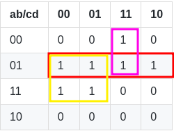

# De la Table de Vérité à la Formule Logique

### Tables de Vérité

- Pour x valeurs d'entrée avec une seule valeur entre 1 et 0, toutes les possibilités sont données.

Exemple avec XOR.
| a | b | résultat |
| - | - | -------- |
| 0 | 0 |   0      |
| 0 | 1 |   1      |
| 1 | 0 |   1      |
| 1 | 1 |   0      |

Exemple plus complexe. (3 variables d'entrée)
| a | b | c | résultat |
| - | - | - | -------- |
| 0 | 0 | 0 |   0      |
| 0 | 0 | 1 |   1      |
| 0 | 1 | 0 |   1      |
| 0 | 1 | 1 |   0      |
| 1 | 0 | 0 |   1      |
| 1 | 0 | 1 |   0      |
| 1 | 1 | 0 |   0      |
| 1 | 1 | 1 |   1      |

Il est possible d'avoir un nombre infini de variables d'entrée.

### Table de Karnaugh

- Simplification d'une table de vérité, la moitié des variables d'entrée sont placées dans les colonnes, et l'autre moitié dans les lignes.

Exemple avec XOR.
| a/b | 0 | 1 |
| --- | - | - |
|  0  | 0 | 1 |
|  1  | 1 | 0 |

Exemple plus complexe. (4 variables d'entrée)
| ab/cd | 00 | 01 | 11 | 10 |
| ----- | -- | -- | -- | -- |
|  00   |  0 |  1 |  0 |  1 |
|  01   |  1 |  0 |  1 |  0 |
|  11   |  0 |  1 |  1 |  1 |
|  10   |  1 |  0 |  1 |  1 |

> En ce qui concerne la première ligne / première colonne, l'ordre 00, 01, 11, 10 est obligatoire.

### De la Table de Karnaugh à la Formule Logique

Table originale.
| ab/cd | 00 | 01 | 11 | 10 |
| ----- | -- | -- | -- | -- |
|  00   |  0 |  0 |  1 |  0 |
|  01   |  1 |  1 |  1 |  1 |
|  11   |  1 |  1 |  0 |  0 |
|  10   |  0 |  0 |  0 |  0 |

Nous formons des rectangles qui contiennent uniquement des '1' et sont aussi grands que possible (chevauchement autorisé !). Les rectangles doivent être composés de 2x cellules.

Maintenant, nous prendrons chaque rectangle individuellement et calculerons sa formule logique. Nous combinons tous les résultats individuels avec l'opérateur ET '+' pour former la formule finale.

Rectangle rouge.
- $\overline{A}.B$

Rectangle rose.
- $\overline{A}.C.D$

Rectangle jaune.
- $B.\overline{C}$

Résultat final :
- $\overline{A}.B+\overline{A}.C.D+B.\overline{C}$