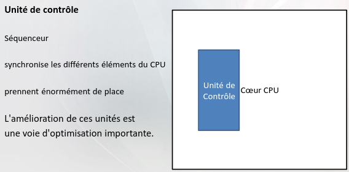
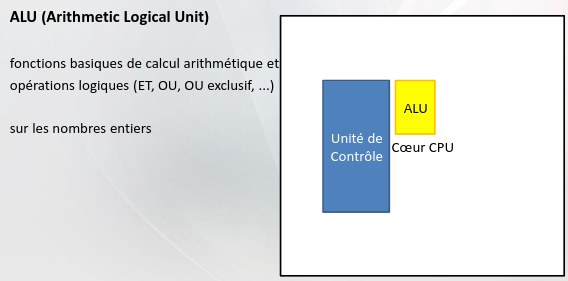
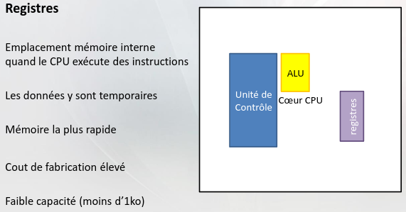
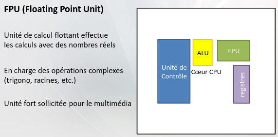

# Questions d'examen types d'architecture des ordinateurs 

* Savoir faire conversion binaire, octale , hexadécimale, décimal (pas opération (+; -; ..) mais bien de revoir)
* Pas fonction logique
* Comment augmenter le débit
    * augmentation des fréquences
    * augmentation du nombre de canaux
* Schéma CPU
    * Unité de controle   
    
    * ALU   
    
    * Registres     
    
    * FPU   
    
    * Unité vectorielle     

* Architecture big/little (page 18)
* Pas fabrication processeur
* Finesse de gravure
* Savoir CPU lié au socket
* Qu'est-ce que la fréquence (p28)
* Connaitre TDP
* Refroidissement (pas caloduc ni chambre à vapeur)
* Connaitre IPC et parallélisme (p52 ; 54)
* Pas connaitre undervolting
* Connaitre CPU superscalaire (p55)
* Pipeline sert juste à augmenter l'IPC
* Hyperthreading (savoir l'expliquer avec des mots)
* Savoir comment calculer les FLOPS
* Qu'est-ce qu'un jeu d'instruction (avec un exemple au moins (p72))
* Benchmark synthétique et applicatif
* RAM
* À quoi sert la RAM
* Mémoire vive, volatile, RAM et barrette de RAM (p3)
* DRAM et SRAM (l'une pour CPU, l'autre mémoire vive PC (p4))
* Les caractéristiques de la RAM et leur explication (p5 ou 6)
* DR (optimisé pour les latences CPU) (p11)
* Comment connaitre la latence à partir du timing (p21)
* C'est surtout le débit qui s'améliore dans les RAM maintenant, pas la fréquence
* Pas UDIMM et RDIMM
* Canaux (multi canaux) (p23)
* Mémoire ECC
* DISQUE DUR
* HDD
* Pourquoi la vitesse est importante
* Savoir qu'il existe 3 pouces, 5 et 2 pouces, 5
* Caractéristiques techniques
* Half duplex et full duplex différence (l'un lit et écrit, l'autre fait l'un ou l'autre pas en même temps)
* Savoir calculer le temps d'accès
* Fragmentation
* IOPS (input/output per second) (juste ça)
* Savoir qu'un HDD n'efface jamais vraiment la donnée
* SSD
* Caractéristiques
* Type de NAND
* C'est quoi un SSD
* SSD vs HDD (p26) /!\
* C'est quoi le RAID et les différents RAID (pas important l'abréviation)
* RAID logiciel, pseudo-matériel et matériel
* CARTE MÈRE
* C'est quoi ?
* Le BIOS (mots en gras en gros)
* Pas connaitre les images des connecteurs (pg7-8-9 pas sur page)
* À quoi sert le chipset (p13)
* Connaitre son emplacement et que le processeur sert à quelque chose (p14)
* Pas ventilateur ni alimentation
* Connaitre VRM (p18)
* Facteur de forme (juste ATX)
* Choix d'une carte mère en résumé (p21)
* Le bloc d'alimentation
* Ça fait quoi (mots en gras en gros (p2))
* Pas PCF actif passif
* Connaitre l'alimentation (wattage à avoir) avec une config donnée (p16)
* Connaitre norme 80 plus
* Savoir qu'on peut prendre modulaire non modulaire
* Comment choisir son alim
* GPU
* À quoi ça sert ?
* Format de GPU
* Connaitre comment est composé le GPU (p4)
* Les critères pour jeu vidéo ou calcul scientifique (dans l'ordre les trucs en gras)
* Caractéristiques du GPU
* Puissance de calcul GPU
* Si jeu vidéo en 32 sinon en 64 (p10)
* Pas texturing memory unit
* Pas Ray tracing
* Pas tensor core
* Pourquoi la mémoire graphique importante ou pourquoi pas
* Bande passante (p18) et comment la calculer (p20)
* L'interface (p24-25) PCI 1 -> 0,25 puis le 2 on double le 3 on double encore...
* Savoir TDP; TGP; TBP (p26)
* Pas API
* Boitier
* RIEN (juste airflow en sah)
* Écran
* C quoi la taille d'un écran et la def (p2)
* Écran LCD (TFT, LED)
* Pas p4-6
* Caractéristique de base (p7)
* Pas rétroéclairage
* OLED
* Def OLED
* OLED VRAI NOIR comparé au reste c pas un vrai noir
* Schéma résumé (p36)

Crédit : Robin the hood