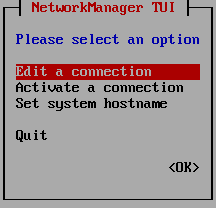
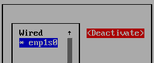

# Sythèse de TP de linux
## TP0 : Table des matières<a name="0"></a>
0. [TP0 : Table des matières](#0)
1. [TP1 : Cmd de base 1](#1)
2. [TP2 : Cmd de base 2](#2)
3. [TP3 : Permissions 3](#3)
4. [TP4 : Gestion des utilisateurs](#4)
4. [TP5 : Sauvegarde](#5)
4. [TP6 : Processus](#6)
4. [TP7 : Fichiers et systèmes de fichiers](#7)
4. [TP8 : Cron](#8)
4. [TP9 : Interface réseau](#9)
4. [TP10 : Gestion des ressources](#10)
4. [TP11 : Les quotas](#11)
4. [TP12 : Arrêt/demarrage](#12)
4. [TP13 : NFS](#13)
4. [TP14 : iptables](#14)
4. [TP15 : LVM script](#15)

## TP1 : commandes fondamentales <a name="1"></a>

### Commande cd

Pour accéder au root directory :

```
cd /
```
Pour accéder au user directory :

```
cd
```

Pour remonter d'un directory :

```
cd ..
```

### Commande ls

```
ls
```

Pour lister les permissions :

```
ls -l
```

### Commande cat

Permet de montrer/écrire des fichiers

```
cat [OPTIONS] [FILE_NAMES]
```

Pour voir les users, on peut taper 

```
cat /etc/passwd
```

### Commande man 

La commande man donne tout simplement le manuel
```
man date
```
Nous donnera le manuel du package date

### Commande useradd

Permet d'ajouter un utilisateur,par exemple appelé toto :

```
useradd toto
```

### Commande passwd

Pour changer le mdp de l'utilisateur actuel :

```
passwd 
```

Pour changer le mdp de l'utilisateur toto :

```
passwd toto
```

### Commande usermod

Permet de modifier un utilisateur

### Commande userdel

Permet de supprimer un utilisateur, par exemple toto :

```
userdel toto
```

Pour supprimer l'utilisateur, son home directory, et son mail utilisateur :

```
userdel toto -r
```
### Commande pwd

Indique le chemin complet du directory ou on se trouve

```
pwd
```

Pour éviter les liens symboliques et avoir l'addresse physique du directory
```
pwd -P
```

### Commande whoami

Pour connaitre son username actuel

```
whoami
```

## TP2 : Gestion des fichiers <a name="2"></a>

## TP3 : Permissions <a name="3"></a>

### Droits d'exécution

Pour afficher les droits :

```
ls -l 
```

En sortie on a :

```
r pour read
w pour write
x pour execute (peut etre même sur des non-executables)
d pour un directory
```

Dans l'ordre on aura le type, les droits de l'user, du groupe autorisé, et autres

```
 t  |  u  |  g  |  o
 d  | rwx | r-x | r--
```

On va voir les permissions associées aux fichiers systemd, inittab, skel :

```
drwxr-xr-x.  5 root root   4096 Sep 17 20:00 systemd
-rw-r--r--.  1 root root    490 Sep 17 20:00 inittab
drwxr-xr-x.  2 root root     62 Sep 15 09:12 skel
```


## TP4 : Gestion utilisateurs <a name="4"></a>

mount -l 

## TP5 : Sauvegarde <a name="5"></a>

## TP6 : Processus <a name="6"></a>

## TP7 : Fichiers et systèmes de fichiers <a name="7"></a>

## TP8 : Cron <a name="8"></a>

## TP9 : Interface réseau <a name="9"></a>

Pour lister les periph réseau :

```
lspci
```

Pour voir si le pilote est chargé :

```
lsmod
```

Pour que grep soit case insensitive :

```
grep -i 
```

Pour l'état des interfaces réseau, soit:

```
ifconfig
```

Ou : 

```
ip -a
```

On peut donc voir l'adresse IP et MAC, par exemple, ```192.168.122.66``` et ```52:54:00:31:66:cb```.

Installation de nmtui sous fedora :

```
sudo dnf install NetworkManager-tui
```




Pour désactiver une interface réseau :




## TP10 : Gestion des ressources <a name="10"></a>

## TP11 : Les quotas <a name="11"></a>

## TP12 : Arrêt/demarrage <a name="12"></a>

### Compte rendu de démarrage

Affichage des infos de démarrage :

```
dmesg
```

On redirige la commande vers un fichier :

```
dmesg > demarrageLog.txt
```

On peut ensuite aller ouvrir le ```demarrageLog.txt```

Puis on verifie que le ```/var/log/messages``` ne contient pas d'erreur relative audémarrage.

### Mode de fonctionnement


## TP13 : NFS <a name="13"></a>

## TP14 : iptables <a name="14"></a>

## TP15 : LVM script <a name="15"></a>