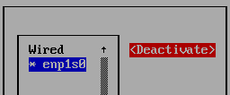

# Sythèse de TP de linux
## TP0 : Table des matières<a name="0"></a>
0. [TP0 : Table des matières](#0)
1. [TP1 : Commandes de base (1)](#1)
2. [TP2 : Commandes de base (2)](#2)
3. [TP3 : Permissions ](#3)
4. [TP4 : Gestion des utilisateurs](#4)
4. [TP5 : Sauvegarde](#5)
4. [TP6 : Processus](#6)
4. [TP7 : Fichiers et systèmes de fichiers](#7)
4. [TP8 : Cron](#8)
4. [TP9 : Interface réseau](#9)
4. [TP10 : Gestion des ressources](#10)
4. [TP11 : Les quotas](#11)
4. [TP12 : Arrêt/demarrage](#12)
4. [TP13 : NFS](#13)
4. [TP14 : iptables](#14)
4. [TP15 : LVM script](#15)

## TP1 : commandes fondamentales <a name="1"></a>

### Commande cd

Pour accéder au root directory :

```
cd /
```
Pour accéder au user directory :

```
cd
```

Pour remonter d'un directory :

```
cd ..
```

### Commande ls

```
ls
```

Pour lister les permissions :

```
ls -l
```

### Commande cat (concatenate)

Permet de montrer/écrire des fichiers

```
cat [OPTIONS] [FILE_NAMES]
```

Pour voir les users, on peut taper 

```
cat /etc/passwd
```

### Commande man 

La commande man donne tout simplement le manuel
```
man date
```
Nous donnera le manuel du package date

### Commande useradd

Permet d'ajouter un utilisateur,par exemple appelé toto :

```
useradd toto
```

### Commande passwd

Pour changer le mdp de l'utilisateur actuel :

```
passwd 
```

Pour changer le mdp de l'utilisateur toto :

```
passwd toto
```

### Commande usermod

Permet de modifier un utilisateur

### Commande userdel

Permet de supprimer un utilisateur, par exemple toto :

```
userdel toto
```

Pour supprimer l'utilisateur, son home directory, et son mail utilisateur :

```
userdel toto -r
```
### Commande pwd

Indique le chemin complet du directory ou on se trouve

```
pwd
```

Pour éviter les liens symboliques et avoir l'addresse physique du directory
```
pwd -P
```

### Commande whoami

Pour connaitre son username actuel

```
whoami
```

### Commande mkdir
```
mkdir directory/
```

### Commande touch

```
touch
``` 

### Commande cal 

Pour montrer un span de trois mois autour de la date

```
cal 30 07 1999 -3
```

### Commande reboot et shutdown

Effet immédiat redémarrage :
```
reboot 
```

Effet immédiat arrêt :
```
shutdown now
```
ou 
```
systemctl halt
```

### Commande locate 

```
locate truc_a_localiser
```

Si le dossier ou fichier est récent, il faut update la db :

```
updatedb
```

### Commande scp

Pour transférer des fichiers par ssh :

```
scp /home/x/Documents/33e8e42ee9e634d3f19d15e6dc6abcc9.jpg root@10.143.90.2:/home/
```

### Commande file

Donne les détails d'un fichier.

```
file Agilent.html
```

### Commande du

Donne la taille d'un fichier (-h pour human readable).

```
du Agilent.html -h
```

### Commande cat

Affiche le contenu d'un fichier.

```
cat /etc/fstab
```

### Commande mv

Bouge les fichiers, localisation, destination (et comme dans linux tout est fichier...).

```
mv bikibean.zip /tmp/bikibean.zip

```

### Commande find

find + emplacement de démarrage + argument + ce qu'il faut par rapport à l'argument. Si pas d'emplacement de démarrage, alors la commande prend par défaut le repertoiire dans lequel on se toruve.

```
find / -name fstab
```
Pour trouver les fichiers modifiés dans un laps de temps de 10 jours (multiples de 24h).

```
find / -ctime -10 

```

### MOTD

Afficher une bannière message of the day. 

```
locate motd
```

Le fichier se trouve dans /etc/motd

```
nano /etc/motd
```

### Commande which

Affcihe le chemin de l'exécutable d'une commande, par exemple avec nano :

```
which nano
```

### Commande whereis

Meme fonction que which mais avec la source et les manuels

```
whereis nano
```

### Commande tty

Renvoie le nom du terminal sur lequel on est connecté

```
tty
```

### Commande last

Montre les dernier utilisateurs à s'être connectés

```
last
```

### Commande wc

Compte les nouvelles lignes, mots, et nb de bytes.

```
wc /home/Agilent.html
```

## TP3 : Permissions <a name="3"></a>

### Droits d'exécution

Pour afficher le contenu d'un dossier et les droits :

```
ls -l 
```

A noter que 
* les directories sont en bleu
* les exécutables sont en vert
* les fichiers sont en gris
* les liens symboliques sont en cyan


En sortie on a :

|   Lettre   | Definition |
|:----------:|------------|
|      r     |    Read    |
|      w     |    Write   |
|      x     |   Execute  |
|      d     |  Directory |

Dans l'ordre on aura le type, les droits de l'user, du groupe autorisé, et autres


 type  |  user  |  group  |  others
 |:----------:|:----------:|:----------:|:----------:|
 d  | rwx | r-x | r--


On va voir les permissions associées aux fichiers systemd, inittab, skel :

```
drwxr-xr-x.  5 root root   4096 Sep 17 20:00 systemd
-rw-r--r--.  1 root root    490 Sep 17 20:00 inittab
drwxr-xr-x.  2 root root     62 Sep 15 09:12 skel
```

Interpretation :
1) Type de fichier. Dans notre exemple, il s’agit d’un répertoire
symbolisé par la lettre "d".
2) Indique les droits d'accès du propriétaire sur ce fichier (rwx :
r=readable, w=writable, x=executable). Ce fichier sera donc accessible en lecture, écriture et exécution pour le propriétaire, root dans notre exemple.
3) Indique les droits (r-x) des utilisateurs membre du groupe auquel est associé le fichier (dans l'exemple, il s'agit du groupe grpadmin). Ceux-ci auront donc un accès en lecture et exécution sur le fichier mais ne pourrons en aucun cas le modifier car il ne possède pas le droit en écriture ( - au lieu de w).
4) Le quatrième champ indique les droits d'accès (r--) de tous les autres utilisateurs, on parle
généralement du reste du monde. Dans notre exemple, ils n'auront qu'un accès en lecture au
fichier.
5) Chiffre qui indique le nombre de liens qui pointent vers ce
fichier. S'il s'agit d'un répertoire, il indique le nombre de sous-répertoires.
6) Indique le nom (root) du propriétaire du fichier.
Le septième champ indique le nom du groupe (grpadmin) associé au fichier.
7) Taille du fichier en octets (16), la date de sa dernière modification (sep 12 12:34) 
8) Nom du fichier (nom_fichier).

### Modification des permissions

1) Mode symbolique

Pour ajouter ou retirer des permissions :

|  Operateur  | Definition     |
|:-----------:|----------------|
|      +      | Ajout          |
|      -      | Retrait        |
|      =      | val. specifiee |

Types de permissions :

|   Lettre   | Definition |
|:----------:|------------|
|      r     |    Read    |
|      w     |    Write   |
|      x     |   Execute  |


Références :

|   Reference  | Definition |
|:----------:|------------|
|      u     |    Owner    |
|      g     |    Group   |
|      o     |   Others  |
|      a     |   All  |

La syntaxe est comme ceci :

```
chmod <reference><operateur><permission(s)> [nom de fichier]
```

2) Mode octal

Trois chiffres qui se suivent comme argument de la commmande :
- le premier est pour l'user
- le deuxième pour le groupe
- le dernier pour others

On calcule le chiffre en additionnant les chiffres correspondant aux permissions accordées :

|Value|	Permission|
|:----------:|------------|
|4	|Read |
|2	|Write |
|1	|Execute |

La syntaxe est comme ceci (RW pour l'owner, RWX pour le groupe, R pour les autres) :

```  
chmod 674 [nom de fichier]
```


## TP4 : Gestion utilisateurs <a name="4"></a>

mount -l 

## TP5 : Sauvegarde <a name="5"></a>

## TP6 : Processus <a name="6"></a>

## TP7 : Fichiers et systèmes de fichiers <a name="7"></a>

## TP8 : Cron <a name="8"></a>

Directory /etc/crontab

## TP9 : Interface réseau <a name="9"></a>

### Identifiez votre périphérique réseau

Pour lister les periph réseau :

```
lspci
```
### Vérifiez que le pilote logiciel est bien chargé.

Pour voir si le pilote est chargé :

```
lsmod
```

### Affichez l'état des interfaces réseaux

Pour l'état des interfaces réseau, soit:

```
ifconfig
```

Ou : 

```
ip -a
```

On peut donc voir l'adresse IP et MAC, par exemple, ```192.168.122.66``` et ```52:54:00:31:66:cb```.

### Activez/désactiver une interface réseau

Installation de nmtui sous fedora :

```
dnf install NetworkManager-tui
```

Qu'on démarre :

```
nmtui
```

Pour désactiver une interface réseau, selectionner ```Activate a connection``` :


Puis selectionner la connexion et la ```Deactivate```



Pour la réactiver, simplement selectionner ```Activate```

### Configurez manuellement (pas de DHCP) votre ordinateur de manière à vous connecter à internet

Pour que grep soit case insensitive :

```
grep -i 
```


## TP10 : Gestion des ressources <a name="10"></a>

### Affichez la mémoire utilisée actuellement par le système

On utilise la commande ```free``` dont l'output est :

```
               total        used        free      shared  buff/cache   available
Mem:         2000272      230172     1221120        5096      548980     1610416
Swap:        6194168           0     6194168
```

Puis on utilise la commande ```watch```

## TP11 : Les quotas <a name="11"></a>

## TP12 : Arrêt/demarrage <a name="12"></a>

### Compte rendu de démarrage

Affichage des infos de démarrage :

```
dmesg
```

On redirige la commande vers un fichier :

```
dmesg > demarrageLog.txt
```

On peut ensuite aller ouvrir le ```demarrageLog.txt```

Puis on verifie que le ```/var/log/messages``` ne contient pas d'erreur relative audémarrage.

### Mode de fonctionnement


## TP13 : NFS <a name="13"></a>

## TP14 : iptables <a name="14"></a>

## TP15 : LVM script <a name="15"></a>