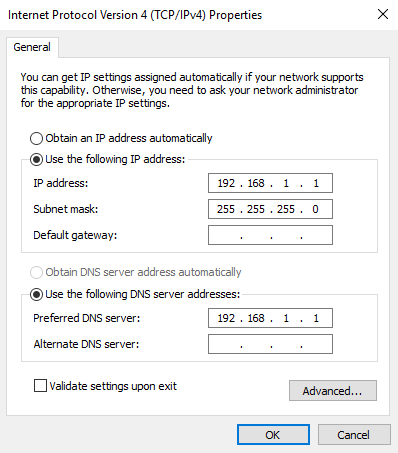
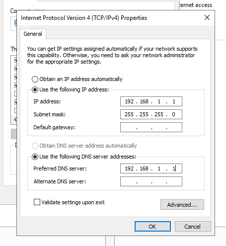
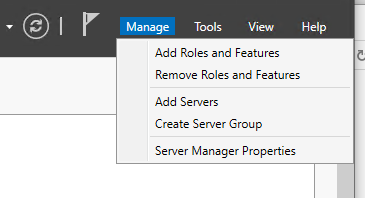
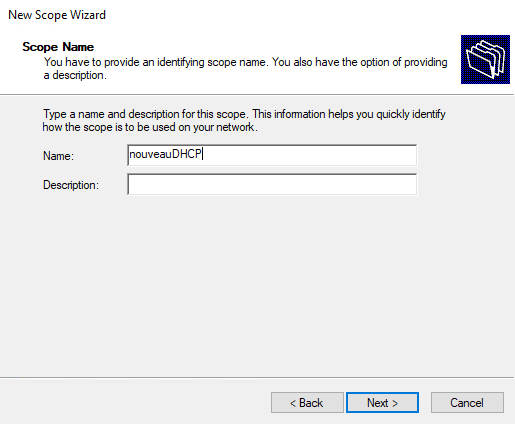
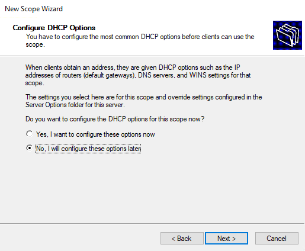
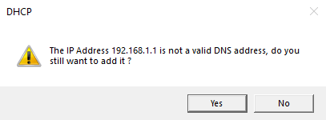
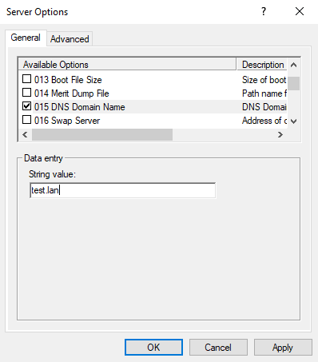
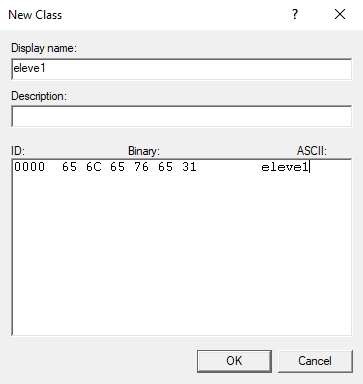
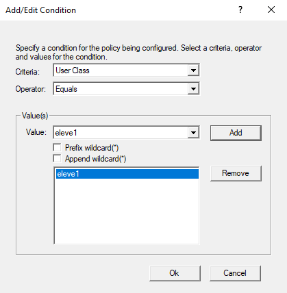

# Notes labo Windows server 🖥

## Table des matières

1. [DNS principal](#dnsprin)
2. [DNS secondaire (non décrit car pas à l'examen pratique)](#dnssec)
3. [DHCP](#dhcp)
4. [AD-DS](#adds)

## TP1 : DNS primaire <a name="dnsprin"></a>

0) Notes de débust de cours 

```
### Consignes
1) Nom
2) IP Fixe
3) Serveur et client doivent communiquer ensemble


Test123*


Mettre ip adress 192.168.1.1
Subnet mask 255.255.255.0
Pas de gateways pcq on ne veut pas se connecter hors du réseau local


en haut à droite du dashboard,

Creer nom de domaine Test.lan

forward lookup zone -> Test.len
Nom en ip   
Obligatoire :
Hote -> serv2019 -> 192.168.1.1
Optionnel :
Alias -> www -> Serv 2019 

reverse lookup zone -> 192.168.1.0
ip en nom
Obligatoire :
Ptr -> 192.168.1.1 -> Hote Serv2019

NSLookUP
-> Nom
-> IP
```

1) Changer le nom du serveur et du client 

    * Panneau de configuration -> System and security -> System -> Advanced system settings
    * Computer name -> Change
    * Mettre le nom 
        * Pour le serveur : NEMO

        

        * Pour le client : DORY
        
    * Redémarrer le serveur


2) Changer l'adresse IP

    

    

    

## TP2 : DNS secondaire <a name="dnssec"></a>

Notes de début de cours 

```
Travail avec DNS secondaire (copie du DNS primaire)

FQDN du serveur = nom du serveur + nom de domaine

Delegation de zone dans le cas ou on a bcp de zones, le serveur primaire a toujours autorité sur la zone mais ne s'en occupe plus (serveur secondaire a les droits d'écriture)
```

## TP3 : DHCP <a name="dhcp"></a>

0) Configurer le nom du serveur (idem que pour DNS)

1) Configurer le serveur avec une IP fixe 
    * IP addr : 192.168.1.1 
    * Subnet : 255.255.255.0 (avec un /24 comme CIDR)
    * DNS principal : 192.168.1.1 (= l'adresse IP du serveur principal)

     

2) Configurer la TimeZone 

3) Configurer le FireWall (ICMPv4) 


4) Installer le DHCP 

    * Dans manage cliquer sur "add roles and features" :

        
    * Selectionner "DHCP server" et cliquer sur "add features" :

         
    * Next next next ... close :

         
5) Cliquer sur le drapeau et "Complete DHCP installation" - "Commit" - "Finish" :
    
    

6) Ouvrir la fenêtre du DHCP dans tools et configurer :
    
    * cliquer droit sur IPv4 et selectionner New Scope :

        

    * Ajouter un nom pour le DHCP (ici, "nouveauDHCP")

        
    
    * Ajouter un range d'IP (ex: de 10 à 60) :

        

    * Ajouter un range d'exclusion d'IP dans le range de base (ex : de 20 à 30)

        

    * Bail = selon le nbre demandé mais attention ne pas le laisser par défaut (4h c'est bien)

    * Choisir de configurer les options de DHCP plus tard :

        

    * Selectionner l'option "Router" et mettre son adresse dans la zone d'exclusion :

        

    * Selectionner l'option "DNS Servers" et lui mettre l'adresse IP du serveur (sur lequel on travaille donc ici 192.168.1.1) :

        
    
    * Oui :

        

    * Selectionner l'option "DNS Domain name" et entrer un nom de domaine (ici, "test.lan") puis cliquer sur "Apply" :

        

7) Créer une classe utilisateur ("Add"):

    * Clic droit sur "Policies" et selectionner "New Policy" :

        

    * Ajouter un "Display name" et une chaine de caractères (les deux ne doivent pas être identiques):

        





### DHCP 
DHCP 192.168.1.0/24
SCOPE 50
Soit 192.168.1.1->254
Soit 192.168.1.1->49  +20%

x3

Plage d'exclusion
Reservation d'une adresse IP par rapport à une adresse MAC

Le couillon qui met au dessus de F pour une adresse mac a zero
Si  adresse mac non précisée, on en met une au hasard

### BAIL
Le BAIL est par défaut à 8 jours lors de l'installation du serveur DHCP 
Chose à ne pas faire est de par exemple mettre 1h
Ne pas descendre en dessous de 4h

### CLASS UT

### OP ETENDUE


### Manipulation DHCP

Dans une installation fraîche :

1) IP statique 192.168.0.1
2) Reboot
3) Dans "Manage" -> "Add roles" on selectionne "DHCP Server" -> "Add features"
4) Install
5) Reboot & snapshot
6) Cliquer sur le drapeau avec un point d'exclamation -> Complete DHCP configuration
7) 


## TP4 : AD-DS <a name="adds"></a>

0) Notes de début de cours 

```
### AD-DS

On ne supprime jamais un compte pcq il y a une serie de choses liées au compte

-> on le désactive

Création des groupes globaux 

### Manipulation AD-DS

1) Dans "Manage" -> "Add roles" on selectionne "Active Directory
Domain Services"
2) Install
3) Cliquer sur le drapeau avec un point d'exclamation -> "Promote this server to a domain controller"
4) "Add a new forest"
5) Ajouter un nom de domaine, par ex. "GHOST.lan"
6) On met un mdp par ex. "Test123*"
7) 

8) DNS primaire = adresse du serveur
9) Installer le role AD-DS


### Unité d'organisation 

> UO = container qui contient tous les objets qu'on peut mettre dans un AD

Orgnaigramme =/= structure de l'AD

-Direct
-RH
    -> Gest
    -> Recrutement
- FIN
    -> Compta
    -> Invest

Profils itinérants -> qui peuvent être bougés avec un utilisateur amené à changer de poste (ex pour bouger dans un autre service)

Dossier dans le C: par exemple appelé "PROFILS$"

Le dollar est supposé être masqué dans le voisinnage réseau.

Dossier doit être partagé pour pouvoir y accéder à distance

Il faut lui attribuer des droits -> RW -> Modification

La ou vont être crées les utilisateurs, il y a un onglet "profils" dans lequel doivent être mis les chemins d'accès vers le dossier partagé. 

//Nomserveur/PROFILS/%USERNAME%

SEUL L'UTILISATEUR EN QUESTION A ACCES A SON DOSSIER!


Deux sources d'erreur :
* Niveau de l'addresse
* Niveau des droits RW

Utilisateurs ont des caractéristiques

* Horaires de connexions
* Profils 
* UPN   
Login@nomdedomaine
* GG Groupes globaux -> UO unité    
GG - compta
* GL Groupes locaux 

---

AGDLP

User directory dans GL -> ZERO


## backup

VEEAM


```

### Installation de l'AD

1) Réaliser un DHCP

2) Installation de l'AD 

    * Dans manage cliquer sur "add roles and features" :

    * ...

3) Dans le menu drapeau, cliquer sur "Promote this server to a domain controller"

4) Créer une nouvelle forêt avec son nom de domaine

5) Options à choisir :

    * Niveaux fonctionnels (version = OS minimum de nos serv)
    
    * Cocher ‘DNS server’ (pour installer le serveur DNS)

    * Définir un mot de passe (sécurisé et à retenir !) (ex : Test123*)

    * Retenir les 3 chemins !

6) Configurer le DNS :

    * 

7) Réactiver le DHCP → DHCP Manager (clic droit) → Authorize

### Configuration de l'AD

1)

### Configuration du partage

### Configuration des quotas

### Configuration Volume Shadow Copy

### Configuration des backups

### Corbeille AD

### AD : GPO → Mappage disque

## TPX : Annexes