# Notes labo Windows server 🖥

## Table des matières

1. [DNS principal](#dnsprin)
2. [DNS secondaire (non décrit car pas à l'examen pratique)](#dnssec)
3. [DHCP](#dhcp)
4. [AD-DS](#adds)

## TP1 : DNS primaire <a name="dnsprin"></a>

0) Notes de début de cours 

    <details>
    <summary> Voir plus </summary>

    ```
    ### Consignes
    1) Nom
    2) IP Fixe
    3) Serveur et client doivent communiquer ensemble


    Test123*


    Mettre ip adress 192.168.1.1
    Subnet mask 255.255.255.0
    Pas de gateways pcq on ne veut pas se connecter hors du réseau local


    en haut à droite du dashboard,

    Creer nom de domaine Test.lan

    forward lookup zone -> Test.len
    Nom en ip   
    Obligatoire :
    Hote -> serv2019 -> 192.168.1.1
    Optionnel :
    Alias -> www -> Serv 2019 

    reverse lookup zone -> 192.168.1.0
    ip en nom
    Obligatoire :
    Ptr -> 192.168.1.1 -> Hote Serv2019

    NSLookUP
    -> Nom
    -> IP
    ```
    </details>

1) Changer le nom du serveur et du client 

    * Panneau de configuration -> System and security -> System -> Advanced system settings
    * Computer name -> Change
    * Mettre le nom 
        * Pour le serveur : NEMO

        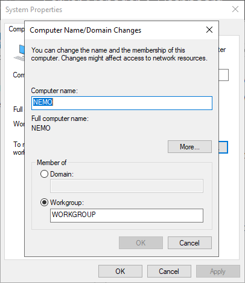

        * Pour le client : DORY
        
    * Redémarrer le serveur


2) Changer l'adresse IP

    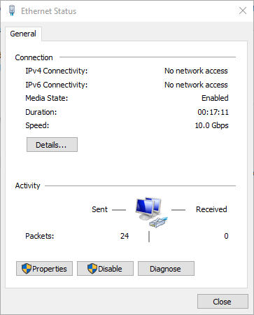

    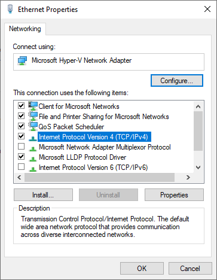

    

3) Installation du DNS

    * Cliquer sur add roles and features 

        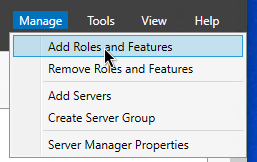

    * "Next" jusqu'à arriver à "server roles"

    * Selectionner "DNS Server" puis "Add Features"

        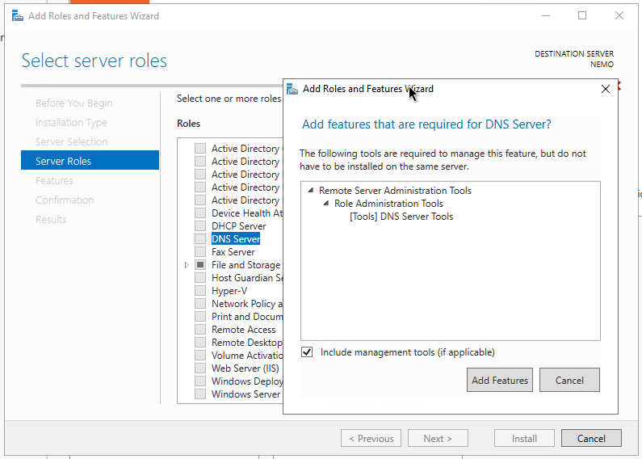

    * "Next" jusqu'au bouton "Install" et selectionner "Install"

4) Configuration du DNS

    * Selectionner l'onglet "Tools" -> "DNS"

        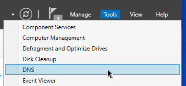
    
    * Créer une Zone Primaire en Forward lookup

        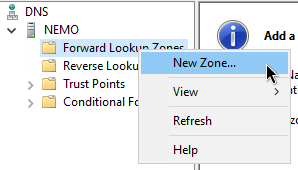

    * Entrer un nom de domaine, par exemple "test.lan" ou ici "testage.lan"

        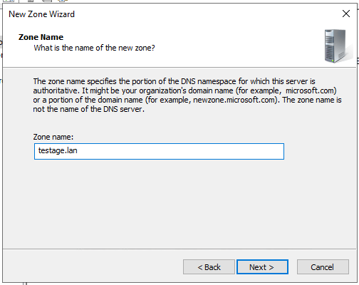

    * "Next" puis "Finish

    * Créer une Zone Primaire dans le reverse lookup

        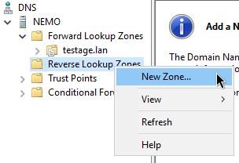

    * Selectionner "IPv4 Reverse ..."

        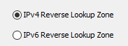

    * Insérer le network ID

        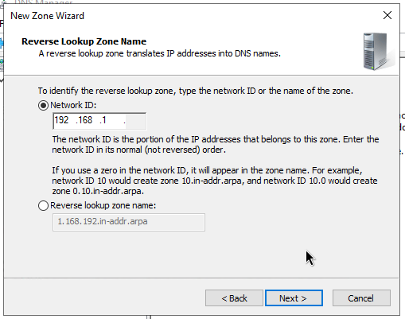

    * "Next" -> "Finish"

    * Créer un nouvel hôte

        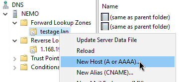

    * Mettre le nom du serveur (ici "NEMO"), et son adresse IP, et cocher la case pointeur :warning:

        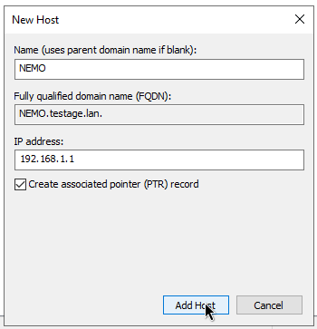

    * Yay!

        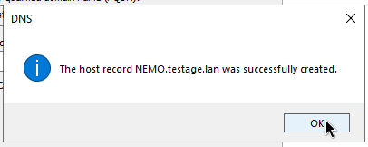

    * La quatrième étape est de créer un alias (par exemple "www")

        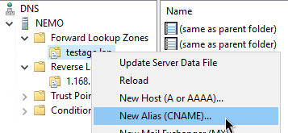

    * Mettre "www" pour le "Alias name"

        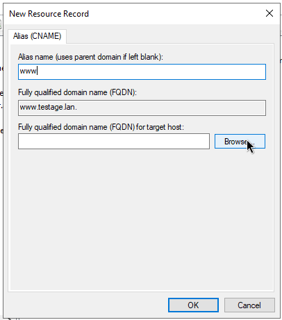

    * Browse jusqu'à l'host

        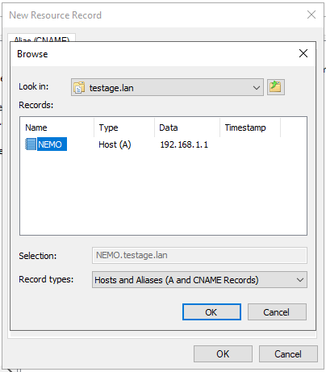

    * Cliquer sur "Ok"

        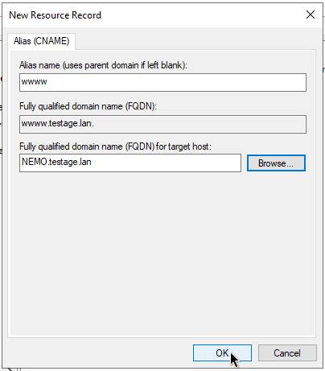

5) Tester le DNS

    * Ouvrir powershell et taper nslookup et puis l'IP du serveur DNS ou le nom de domaine.

    * Sur le client :

        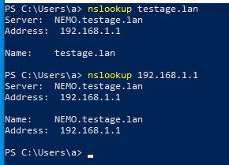 

    * Sur le serveur :

        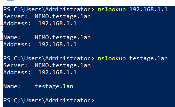

    * And voilà !

## TP2 : DNS secondaire <a name="dnssec"></a>

### Notes de début de cours 

<details>
    <summary> Voir plus </summary>

```
Travail avec DNS secondaire (copie du DNS primaire)

FQDN du serveur = nom du serveur + nom de domaine

Delegation de zone dans le cas ou on a bcp de zones, le serveur primaire a toujours autorité sur la zone mais ne s'en occupe plus (serveur secondaire a les droits d'écriture)
```

</details>

## TP3 : DHCP <a name="dhcp"></a>

### Notes de début de cours

<details>
    <summary> Voir plus </summary>

```
### DHCP 

DHCP 192.168.1.0/24
SCOPE 50
Soit 192.168.1.1->254
Soit 192.168.1.1->49  +20%

x3

Plage d'exclusion
Reservation d'une adresse IP par rapport à une adresse MAC

Le couillon qui met au dessus de F pour une adresse mac a zero
Si  adresse mac non précisée, on en met une au hasard

### BAIL
Le BAIL est par défaut à 8 jours lors de l'installation du serveur DHCP 
Chose à ne pas faire est de par exemple mettre 1h
Ne pas descendre en dessous de 4h

### CLASS UT

### OP ETENDUE

### Manipulation DHCP

Dans une installation fraîche :

1) IP statique 192.168.0.1
2) Reboot
3) Dans "Manage" -> "Add roles" on selectionne "DHCP Server" -> "Add features"
4) Install
5) Reboot & snapshot
6) Cliquer sur le drapeau avec un point d'exclamation -> Complete DHCP configuration
7) 
```
</details>

### Prerequis

0) Configurer le nom du serveur (idem que pour DNS)

1) Configurer le serveur avec une IP fixe mais :warning: le(s) client doi(ven)t être en dynamique.
    * IP addr : 192.168.1.1 
    * Subnet : 255.255.255.0 (avec un /24 comme CIDR)
    * DNS principal : 192.168.1.1 (= l'adresse IP du serveur principal)

     

2) Configurer la TimeZone 

3) Configurer le FireWall (ICMPv4) 


### Installation du DHCP 

1) Dans manage cliquer sur "add roles and features" :

    

2) Selectionner "DHCP server" et cliquer sur "add features" :

    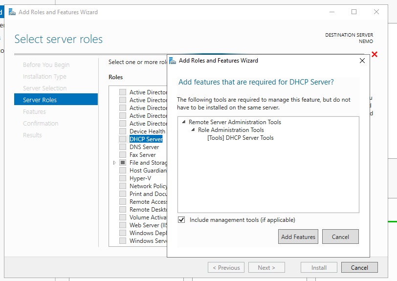

3) Next next next ... close :

    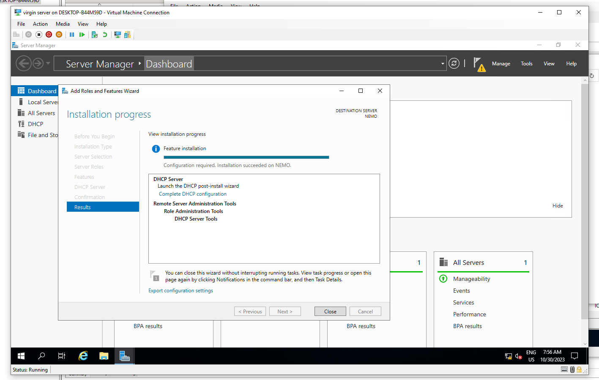

4) Cliquer sur le drapeau et "Complete DHCP installation" - "Commit" - "Finish" :
    
    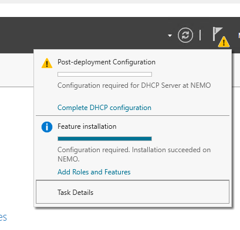

### Configuration du DHCP

1) Ouvrir la fenêtre du DHCP dans tools et configurer :
    
    * cliquer droit sur IPv4 et selectionner New Scope :

        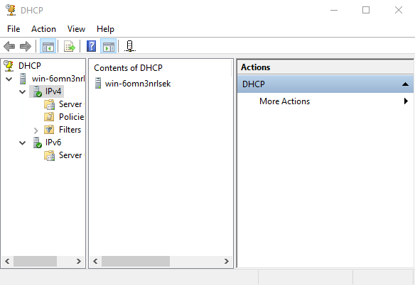

    * Ajouter un nom pour le DHCP (ici, "nouveauDHCP")

        
    
    * Ajouter un range d'IP (ex: de 10 à 60) :

        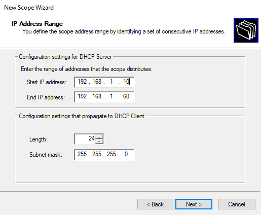

    * Ajouter un range d'exclusion d'IP dans le range de base (ex : de 20 à 30)

        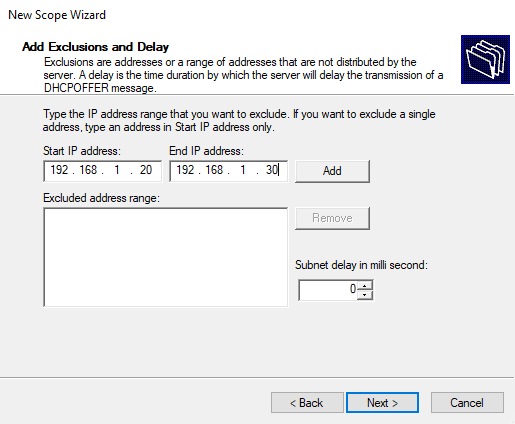

    * Bail = selon le nbre demandé mais attention ne pas le laisser par défaut (4h c'est bien)

    * Choisir de configurer les options de DHCP plus tard :

        

    * Selectionner l'option "Router" et mettre son adresse dans la zone d'exclusion :

        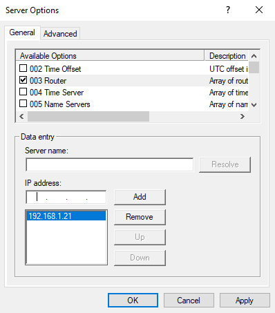

    * Selectionner l'option "DNS Servers" et lui mettre l'adresse IP du serveur (sur lequel on travaille donc ici 192.168.1.1) :

        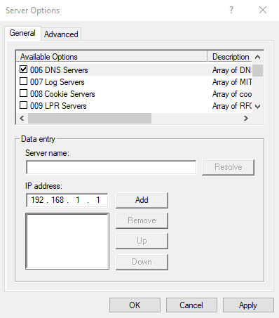
    
    * Oui :

        

    * Selectionner l'option "DNS Domain name" et entrer un nom de domaine (ici, "test.lan") puis cliquer sur "Apply" :

        

7) Créer une classe utilisateur ("Add"):

    * Clic droit sur "Policies" et selectionner "New Policy" :

        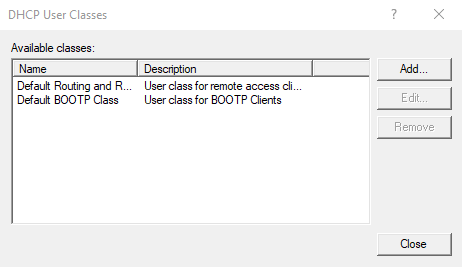

    * Ajouter un "Display name" et une chaine de caractères (les deux ne doivent pas être identiques):

        
    * Ajouter un nom pour la policy et sa description
        
        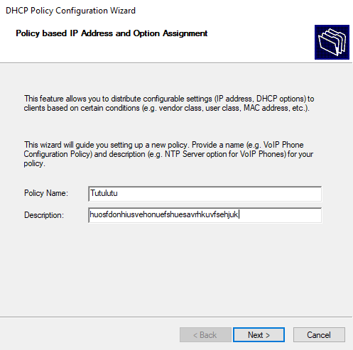

    * Ajout de la condition pour la police : Equals to user class

        

    * Selectionner un range d'IPs pour la police

        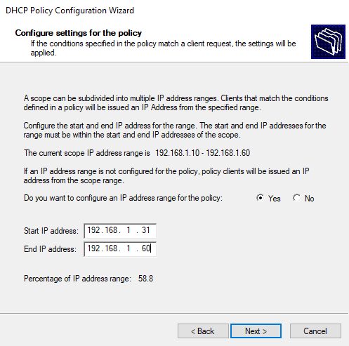

    * Set l'id de classe pour le bon adaptateur réseau

        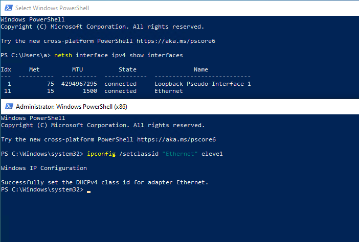

    * :warning: Ne pas oublier d'activer le DHCP :warning:

        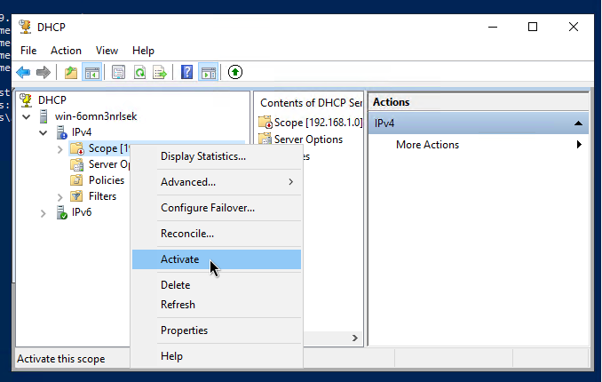


## TP4 : AD-DS <a name="adds"></a>

### Notes de début de cours 

<details>
<summary> Voir plus </summary>


```
### AD-DS

On ne supprime jamais un compte pcq il y a une serie de choses liées au compte

-> on le désactive

Création des groupes globaux 

### Manipulation AD-DS

1) Dans "Manage" -> "Add roles" on selectionne "Active Directory
Domain Services"
2) Install
3) Cliquer sur le drapeau avec un point d'exclamation -> "Promote this server to a domain controller"
4) "Add a new forest"
5) Ajouter un nom de domaine, par ex. "GHOST.lan"
6) On met un mdp par ex. "Test123*"
7) 

8) DNS primaire = adresse du serveur
9) Installer le role AD-DS


### Unité d'organisation 

> UO = container qui contient tous les objets qu'on peut mettre dans un AD

Orgnaigramme =/= structure de l'AD

-Direct
-RH
    -> Gest
    -> Recrutement
- FIN
    -> Compta
    -> Invest

Profils itinérants -> qui peuvent être bougés avec un utilisateur amené à changer de poste (ex pour bouger dans un autre service)

Dossier dans le C: par exemple appelé "PROFILS$"

Le dollar est supposé être masqué dans le voisinnage réseau.

Dossier doit être partagé pour pouvoir y accéder à distance

Il faut lui attribuer des droits -> RW -> Modification

La ou vont être crées les utilisateurs, il y a un onglet "profils" dans lequel doivent être mis les chemins d'accès vers le dossier partagé. 

//Nomserveur/PROFILS/%USERNAME%

SEUL L'UTILISATEUR EN QUESTION A ACCES A SON DOSSIER!


Deux sources d'erreur :
* Niveau de l'addresse
* Niveau des droits RW

Utilisateurs ont des caractéristiques

* Horaires de connexions
* Profils 
* UPN   
Login@nomdedomaine
* GG Groupes globaux -> UO unité    
GG - compta
* GL Groupes locaux 

---

AGDLP

User directory dans GL -> ZERO


## backup

VEEAM


```

</details>

### Installation de l'AD

1) Réaliser un DHCP

    * Voir TP 3

2) Installation de l'AD 

    * Dans manage cliquer sur "add roles and features" :

    * Selectionner "Active Directory Domain Services" -> "add feature" -> nextnextnext... :
    
        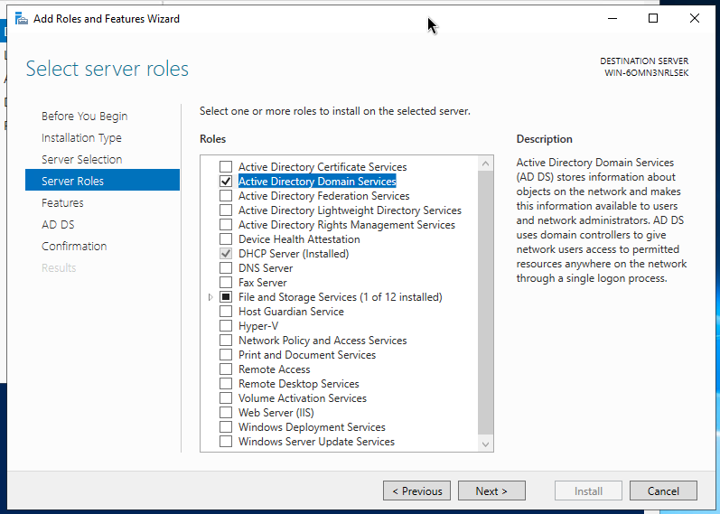
    

3) Dans le menu drapeau, cliquer sur "Promote this server to a domain controller"

    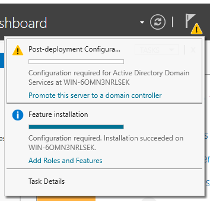

4) Créer une nouvelle forêt avec son nom de domaine

    

5) Options à choisir :

    * Niveaux fonctionnels (version = OS minimum de nos serv)
    
    * Cocher ‘DNS server’ (pour installer le serveur DNS)

    * Définir un mot de passe (sécurisé et à retenir !) (ex : Test123*)

        

    * Pas de délégation de DNS

        

    * Le nom du NETBIOS est configuré automatiquement :

        

    * Retenir les 3 chemins !

        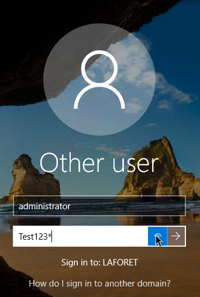    

6) Configurer le DNS :


    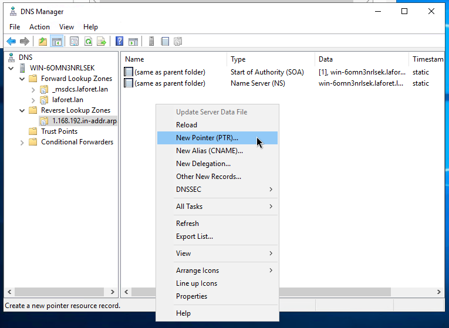

7) Réactiver le DHCP → DHCP Manager (clic droit) → Authorize

    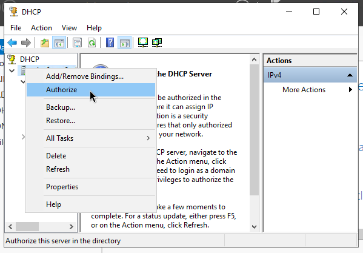

    Appuyer sur refresh après quelques instants

    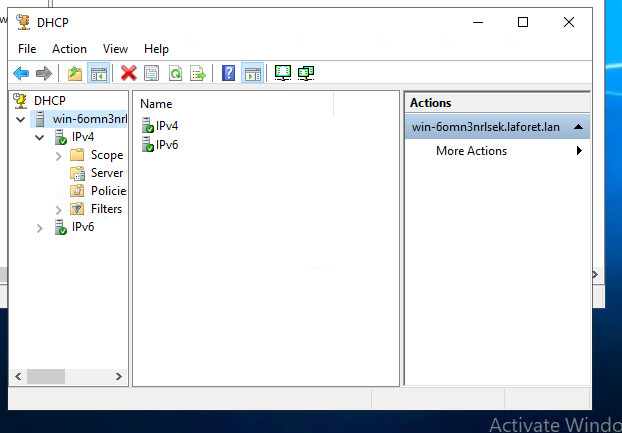

    Et comme par magie, tout est vert !

    On check avec ipconfig /all

    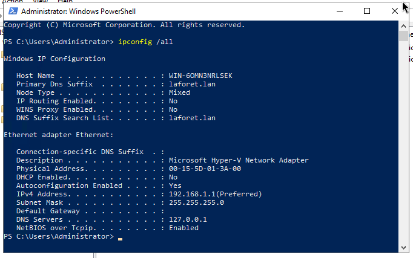

    Parfait !

### Configuration de l'AD

1) Ajouter des ressources dans Active Directory Users And
Computers :

    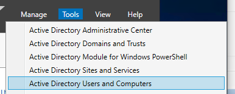

    * Créer des OU (pour chaque sections)

        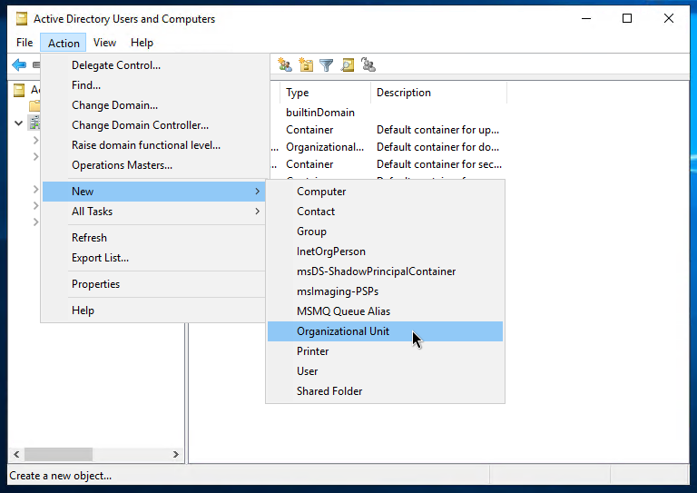

    * Bien décocher l'option qui protège, sinon c'est chiant

        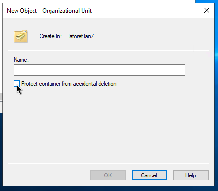

        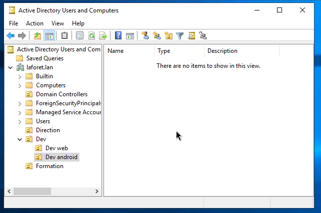

    * Créer un groupe global par UO


    * Créer un modèle d’utilisateur et définir les options spécifiques :
        * Account → Logon Hours : Horaire de connexion
        * Profile → Profile path : profil itinérant
    * Créer des utilisateurs et les ajouter à l’UO
    * Créer une délégation de contrôle → clique droit sur l’UO → ‘Delegate Control…’

2) Ajouter un UPN (@domain) different :
    * Dans Active Directory Domains and Trusts → clique droit → ‘UPN Suffixes' : ajouter le domaine
    * Dans les propriétés du user → Account

### Configuration du partage

1) Création de groupes locaux
    * 2 Groupes locaux (R et RW) par dossier du partage
contenant des groupes globaux
2) Création et partage d'un dossier dans C:\
    * Clic droit → Propriétés → Share
    * Désactiver l'héritage
    * Configurer les permissions (les 2 GL pour chaque dossier)
3) Ajouter les GG dans les GL
    * Mettre les groupes globaux et/ou les utilisateurs dans les groupes locaux associé à leurs permissions
    * Ne pas oublier d’ajouter tout le monde au dossier principal en lecture seulement

### Configuration des quotas

1) Installer le rôle File Server Ressource Manager (Server
Manager → Manage)
2) Configurer les quotas (File Server Ressource Manager)
* Créer un template de quota (à partir d’un autre)
* Créer les quotas à partir d’un template
* Un quota s'applique uniquement à un dossier (pas un user ou un groupe) !
* Appliquer le quota au dossier parent
3) Tester sur le client

### Configuration Volume Shadow Copy

Shadow copy permet de réaliser un instantanée des
fichiers/dossiers du partage

1) Dans les propriétés du disque (C:\) :
    * Activer les Shadow Copies
    * Modifier l’horaire de prise des snapshots
        * Dans ‘Settings…’ → ‘Schedule…’
2) Tester sur le client

### Configuration des backups

1) Installer la fonctionnalité Windows Server Backup (Server
Manager → Manage)
2) Ajouter un disque dur (Disk Management/Diskpart permet de
créer la partition)
3) Configurer les backups (Windows Server Backup)
    * Cliquer sur Local Backup
    * Action → Configure Performance Settings
        * Sélectionner ‘Faster backup performance’ pour réaliser des sauvegardes incrémentielles
    * Créer un job de backup : ‘Backup Schedule…’
        * Créer un backup custom
        * Ajouter ‘System state’ (pour save les configs)
        * Ajouter C:\Windows\NTDS et C:\Windows\SYSVOL
        * Ajouter les dossier partagés (et profile itinerant)
    * Choisir l’horaire et l’emplacement (disque de backup)

### Corbeille AD

1) Dans Active Directory Administrative Center
* Sélectionner la racine du domaine
* ‘Enable Recycle Bin…’

:warning: Vaut 1 point à l’examen pratique, ne pas l’oublier ! :warning:

### AD : GPO → Mappage disque

1) Dans Group Policy Management
    * créer une GPO (et la linker au domaine)
    * Éditer la GPO
        * Choisir l’action et la configurer (ici mappage d’un disque réseau)
2) Tester en se connectant sur le client

## TPX : Annexes

### AD : Profile itinérant
1) Créer un dossier dans C:\ et le partager
    * Mettre un ‘$’ à la fin du nom du dossier permet de le cacher au client (recommandé)
    * Les seule permissions du partage doivent être
    RW pour le groupe disposant d’un profile itinerant (et pas de droit pour admin !)
2) Ajouter le chemin réseau du partage dans les propriétés des comptes :
    * Dans : Profile → Profile path
    * //<server name>/PROFILS$/%username%

### AD : Délégation de contrôle


### Résolution problème de connexion à l'AD

* Erreur d'Hyper-V → cliquer sur ‘Enhanced session’

### Supprimer un objet de l’AD

* Par défaut, les objets de l’AD sont protéger de la suppression.
* Il faut donc désactiver cette protection pour pouvoir supprimer un objet !
* Pour se faire, aller dans les propriétés de l’objet, section objet et décocher la case →

Bonne chance (come mierda comme on dit <3)

# Sources

* https://www.it-connect.fr/dns-sous-windows-server-2022-comment-configurer-une-zone-de-recherche-inversee/

Chauds remerciements à 

* https://github.com/Ika-02

* https://github.com/Maximilien-Bruyere

* https://github.com/shadowthib

