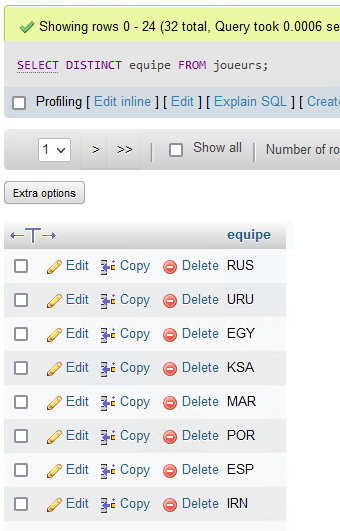

## Points importants :

SELECT
WHERE
ORDER BY
AND
OR
INSERT INTO
UPDATE
DELETE
MIN MAX
COUNT (SUPER IMPORTANT)
SUM
AVG
LIKE (IMPORTANT)

tous les join sauf le self
group by 
having

formulaires get et post

requete
requete preparée

regex


## Synthèse sur les requêtes SQL

Pour sélectionner toute la table "Customers" :
```
SELECT * FROM joueurs;
```


Pour sélectionner le colonne equipe dans la table joueurs :
```
SELECT equipe FROM joueurs;
```


Pour sélectionner les éléments distincts d'une colonne d'un tableau

```
SELECT DISTINCT equipe FROM joueurs;
```



