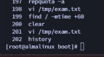
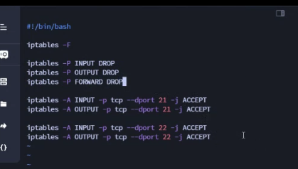
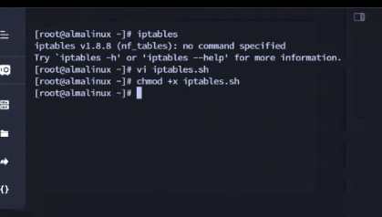
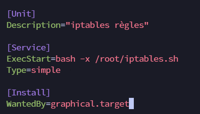
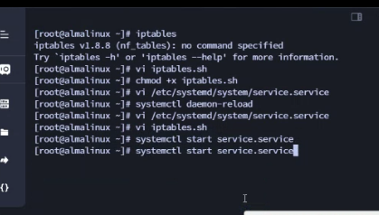
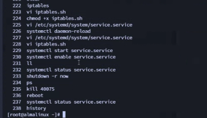

# Resumé Exam 2019 Linux TP

1) Créez quatre comptes utilisateur : 
    * login : user1 ; mot de passe : user1 cd
    * login : user2 ; mot de passe : user2
    * login : examuser ; mot de passe : examuser
    * login : lastuser
        ◦ mot de passe : lastuser
        ◦ le mot de passe expirera demain.

    ```
    useradd user1
    useradd user2
    useradd examuser
    useradd lastuser

    passwd user1
    passwd user2
    passwd examuser 
    passwd lastuser
    ```
    soit
    ```
    passwd -x 1 examuser
    ```
    ou
    ```
    chage
    ```

2) Faites-en sorte que seuls les utilisateurs user1 et user2 aient un accès en lecture et exécution au répertoire (à créer) /users. Personne d'autre ne doit avoir accès au répertoire (root peut y avoir accés).

    ```
    mkdir /users
    groupadd groupusers
    usermod -aG groupusers user1
    usermod -aG groupusers user2

    id user1 //pour voir l'ID

    chown root:groupusers /users //root = nouveau proprio et groupusers = groupe associé

    chmod 070 /users

    ```


3) Tous les utilisateurs qui seront créés sur le système doivent avoir un fichier roi.txt dans leurs dossiers personnels ajouté automatiquement.

    ```
    cd /etc/skel
    touch roi.txt
    ```


4. Créez un répertoire /exam. N'importe quel utilisateur doit pouvoir y placer des fichiers, mais ces fichiers ne peuvent pas être effacés par un autre utilisateur que celui qui les y a mis. 

    ```
    mkdir /exam
    chmod 1777 /exam
    ```
Pour retirer le sticky bit

    ```
    chmod 0777 /exam 
    ```


5. Configurez l’interface réseau afin de permettre aux futurs utilisateurs du PC de se connecter sur Internet. Les données du réseau sont les suivantes :
IP : 192.168.0.1/24
DNS : 192.168.0.1
DNS secondaire : 8.8.8.8
    
    ```
    nmtui
    ```


6. Créer un partage NFS pour ce réseau uniquement en lecture et écriture dans le dossier /partage. Faites-en sorte que tous les fichiers qui y sont créés à distance appartiennent à l’utilisateur user2.

    ```
    Pour la partie NFS : 
    étape 1 : créer le fichier que tu veux partager
    mkdir /partage
    étape 2 : modifier les perms du répertoire pour que tous les utilisateurs ayant accès au /partage puisse écrire
    chmod 777 /partage comme ça les personnes qui ont accès au dossier /partage peuvent écrire dedans (je ne sais pas réellement quelles permissions faut accorder à l'user princ, group princ et les autres utilisateurs.
    étape 3 : modifier le fichier /etc/exports
    /partage [appuyer sur la touche tab] adresse_réseau/CIDR(rw,sync,all_squash,anonuid=[UID de ton utilisateur],anongid=[GID de ton utilisateur])
    le anongid et uid feront en sorte que tes fichiers créer dedans aient comme user princ & group princ ton UID précédemment mis dans /etc/exports
    étape 4 :
    exportfs -a
    étape 5 : modification de ton /etc/fstab
    [adresse_ip_de_ton_serveur]:/partage          /mnt/[le dossier dans lequel tu veux monter ton partage (le rendre accessible en gros)           nfs           defaults      1             1 je préviens que ce ne sont pas des espaces entre chaque truc mais des tabulations [appuyer sur la touche tab] 
    étape 6 : tout reload
    systemctl daemon-reload
    étape 7 : monter tout
    mount -a
    ```

    ```
    mkdir /partage
    chmod 777 /partage
    nano /etc/exports
    ```
Ajouter 

```
/partage [appuyer sur la touche tab] adresse_réseau/CIDR(rw,sync,all_squash,anonuid=[UID de ton utilisateur],anongid=[GID de ton utilisateur])
```

Puis 
```

```

Puis
    ```
    systemctl enable nfs-server
    systemctl start nfs-server
    mkdir /partage
    nano /etc/exports
    ```

    Mettre les options correctes, supposant que l'id du user2 est 1002 :

    ```
    /partage        192.168.200.0/24(rw,sync,all_squash,anonuid=1002,anongid=1002)
    ```

    Puis :

    ```
    exportfs -a
    mkdir /mnt/nfs
    dc /mnt
    ll
    nano /etc/fstab
    ```

    Ajouter :
    ```
    192.168.200.2:/partage  /mnt/nfs        nfs     defaults        1       1
    ```

    Puis :

    ```
    systemctl daemon-reload
    mount -o remount /home
    cd /mnt
    ll
    cd nfs
    touch hello 
    ll          //constater que le fichier appartient au user avec l'ID 1002 (voir au dessus)
    ```

7) Réalisez une commande linux qui permettra d’afficher le fichier de configuration de l’interface réseaux. Cette commande sera toto.
```
nano /etc/bashrc
```

Ajouter 
```
alias toto="cat /etc/NetworkManager/system-connections/eth0.nmconnection"
```

Verifier que la commande fonctionne

```
toto
```


8) Toutes les 12 minutes, entre 8h et 12h aujourd’hui. Vous devez vérifier la quantité de cpu utilisée et la stocker dans le fichier /tmp/cpu. A chaque fois que root se connectera il devra voir les 10 dernières lignes de ce fichier. 

```
crontab -e 
```

Rajouter 
```
12 8-11 24 1 3 commande avec top >> /tmp/cpu
```

Pour aide :
```
cat /etc/crontab
```
dans le bashrc, ajouter :

```
tail /tmp/cpu
```


9) Pour protéger les utilisateurs contre un manque de ressources, mettez en place des quotas d'espace disque de manière à ce que l'utilisateur examuser ne puisse pas saturer le disque en stockant des données dans son répertoire personnel (/home). La limite est de 200 Mo, 1 bloc est égal à 1ko.

nano /etc/fstab

ajouter ,usrquota apres defaults dans la partition cible

mount -o remount /home

optionnellement systemctl daemon-reload

quotacheck -avug

edquota examuser

limite dure à 200 000 (kilooctets)

quotaon -a

repquota -a0

10) Ecrivez, dans le fichier /tmp/exam.txt, la commande permettant de rechercher et affichez tous les fichiers possédant des droits d’endossements de propriétaire.




Rajouter

find / -type f -perm -4000 -o -perm -2000
find / -type f -mtime +60

11) Vous devez protéger la partition /boot en la configurant en lecture seule.

nano /etc/fstab

modifier partition /boot remplacer defaults par ro 

mount -o remount /boot

12) Ajoutez 1 Go d’espace disque à l’aide des LVM au /home.


13) Ecrivez un script permettant de configurer Iptables afin de sécuriser le PC en autorisant uniquement les ports 21 et 22. Ce script doit être lancé automatiquement au démarrage de la machine en tant que service au niveau graphique.












Pour garder le ssh 


## Commandes utiles

```
history
```

Rendre immuable 

```
touch hello
chattr +i hello
```

Rendre muable 

```
chattr -i hello
```

Supprimer tous les fichiers d'un user
```
find / -user [user] -delete
```

UID :
```
cat /etc/passwd
```