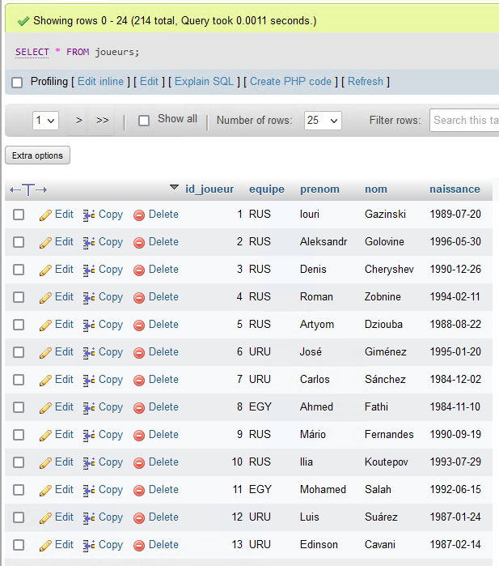
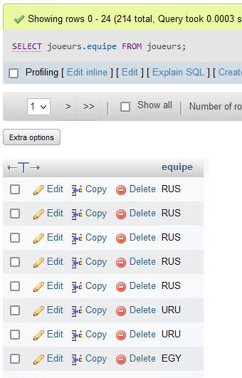
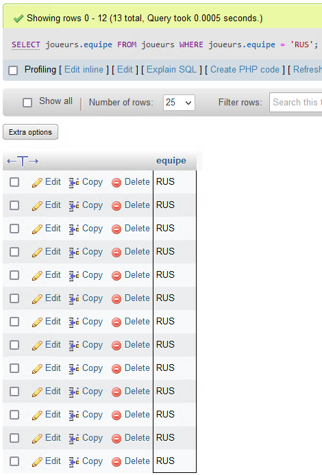

## Points importants :

- SELECT
- WHERE
- ORDER BY
- AND
- OR
- INSERT INTO
- UPDATE
- DELETE
- MIN MAX
- COUNT (SUPER IMPORTANT)
- SUM
- AVG
- LIKE (IMPORTANT)

tous les join sauf le self
group by 
having

formulaires get et post

requete
requete preparée

regex


## Synthèse sur les requêtes SQL

### SELECT

Pour sélectionner toute la table "Customers" (* veut dire all):
```
SELECT * FROM joueurs;
```


Pour sélectionner le colonne equipe dans la table joueurs :
```
SELECT equipe FROM joueurs;
```


Rigoureusement, on précise que l'on sélectionne la colonne qui vient d'une table précise (pas de conflits quand on importe plusieurs tables) :

```
SELECT joueurs.equipe FROM joueurs
```



### WHERE

Pour sélectionner les lignes auxquelles la colonne possède la valeur :

```
SELECT joueurs.equipe FROM joueurs WHERE joueurs.equipe = 'RUS';
```

