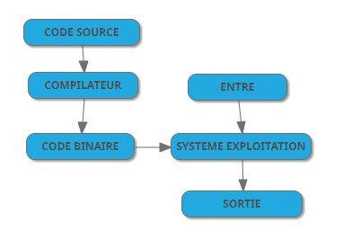
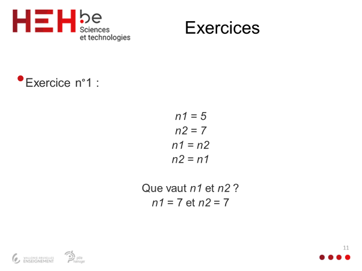
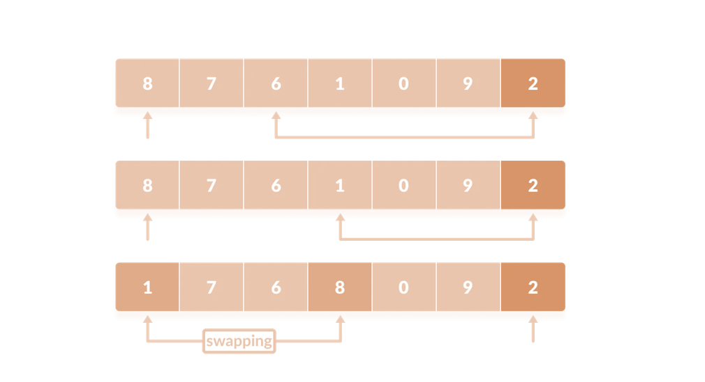
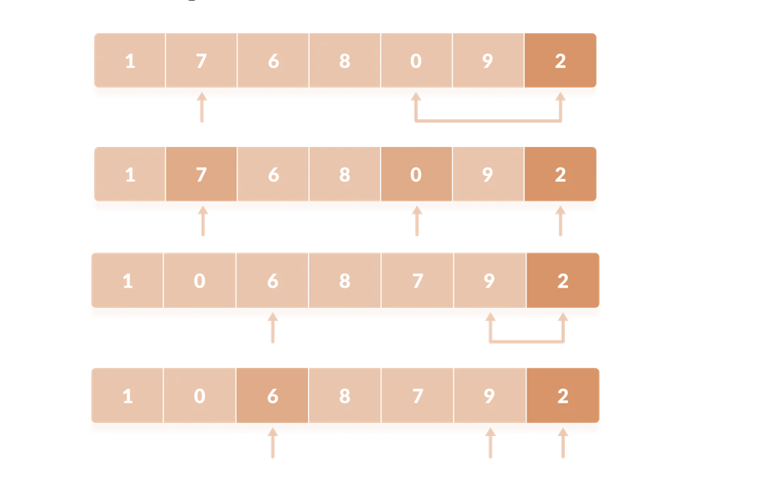

# Programmation

Date de création: 14 septembre 2023 18:48
Supports: https://ecampus.heh.be/mod/folder/view.php?id=67649


# Introduction :

```jsx
tri
algo compression
```

- **Les ordinateurs :**
    
    **Rôles** : 
    
    - Communiquer/ archiver les informations
    - Traiter des informations avec un programme
    - Ces rôles sont tenu grâce à :
        - La mémoire (stockage)
        - L’unité centrale
        - Les périphériques (clavier, souris, ..)
        - L’unité arithmétique et logique (Alu (Fais le calcul))

Un **programme** : un ensemble d’instruction/opérations  exécuter par l’ordinateur

Un **programme binaire** :  description de l’instruction (langages machines)

Un **programme source** : le code écrit par le dev

- **Assembleur** —> Langage le + proche de la machine (le + compréhensible par l’homme)

      `Code source —> interprété —> binaire`

`(Commande)     (Java, Python)     (01001110)`

- **Langage évolué :**
    - Compilation
        
        
        
        C+; C++
        
    - Interprétation
    
    
    
    Java, Python
    
- **Programmation** : Ensemble des choses qui vont permettre d’écrire un programme

- pour écrire une programme les différentes étapes se nomment phases

- **Différentes Phases :**
    1. Définir besoin
    2. Analyse (on se demande quoi/manière d’y arrive)
    3. Implémentation (écrire code)
    4. Tests (unitaire; intégration, acceptation)
    5. Maintenance/évolution (comment le maintenir/évoluer)
    
    - **Computation of thinking**
        - Input —> programme —> Output
        - Eléments principaux :
            1. **Décompose** (gros problème en différents petit problème)
            2. **Recognition paterne** (solution similaire pour problème un peu diff)
            3. **abstraction** (sortir du contexte et trier important ou non (ce qu’on veut et pas le “décor”)
            4. **Algorithme** ( que faire pour arriver au résultat

- **Paradigme** :
    - Programmation impérative (procédurale)
    - Programmation orienté objet (POO) (Peu importe problème peut ramener à un objet)
    - Programmation déclarative :
        - Fonctionnelle
        - Logique

• **Une variable** : un nom qui permet d’accéder à un emplacement dans la mémoire centrale.

**Commence pas par une Maj/chiffre (et pas d’espace dedans)**

- Le **type d’une variable** sert à savoir **comment** la **valeur** a été **codée**.

- La **place en mémoire va dépendre du type.**
- Types fréquents :
    - **Entiers**
    - **Réels**
    - **Caractères**
    - **Booléens**
    
- Typage statique / dynamique

- Typage explicite / implicite
    
               int i = 0;      i = 0
    

- Typage fort / faible

- **La déclaration**
    - Si le langage est explicite, il faut prévoir la place en mémoire.

- **L’affectation**
    - Instruction qui consiste à placer une valeur dans une variable.

- **EXO**
    - 
        
        
        
        
        


- **Instruction répétitive** :  exécuter un bloc d’instructions plusieurs fois de suite selon une ou plusieurs conditions.
    - **boucle avec compteur (for**) : —> compteur et condition d’arrêts
        
        
        
    - **boucle conditionnelles (while/do … while)**
        
        
        
    - **Boucles de parcours (foreach)**
        
        
        

- **EXO**
    
    
    
    
    
    
    
    
    

- **Spécification d’un problème**
    - **Paramètres d’entrée**
        
        → Caractériser une instance du problème
        
        → Variables de l’énoncé
        
    - **Pré-conditions**
        
        → Conditions à respecter pour que le problème aie un sens
        
    - **Paramètres de sortie**
        
              → Caractérise la solution à une instance du problème
        
        → Eléments de la réponse
        
    - **Post-conditions**
        
               → Conditions à respecter par les paramètres d’entrée et de sortie
        
    
    - **EXEMPLE**
        
        • Trouver le chemin le plus court entre 2 endroits *a* et *b* dans Mons
        
        Entrée a – une adresse
        Entrée b – une adresse
        Pré-condition – a et b sont à Mons
        Sortie c – un chemin
        Post-condition  – 	c relie a et b
        longueur(c) < longueur(c’)
        

- **********Algorithme********** : Méthode permettant de résoudre des problème systématiquement
    - **3 Preuves :**
        - Terminaison : s’assurer que l’algorithme terminera en un temps fini
        - Connection : s’assurer que le résultat fourni par l’algorithme est la solution au problème
        - Complétude : s’assurer que l’algorithme donne une bonne réponse peu importe la variable

- **Structure de contrôle :**
    - Séquence
    - conditionnelle
    - boucle

- Structure de données :
    - Constante
    - Variable
    - Tableaux
    - Structure récursive
    

## Structure de donné

Représenter les données efficacement : 

- **Tableaux** :
    - Accès par index tab [0] = 12
    - Données contigües
    - Ajout/supression impossible
    - + attribue un seul nom pour ensemble variable
    - + connaitre nbr élément et leur type
    

- **liste chainée**
    
    
    | 12 |          —> | 32 |          —> |
    | --- | --- | --- | --- |
    
    nœud
    
    Chaque nœud contient : 
    
    | 12 |          —> | 32 |          —> |
    | --- | --- | --- | --- |
    |           ^ |  |  |            I |
    |            | |  |  |            | |
    |           <— |           <— |           <— |           <— |
    1. L’élément (chiffre; lettre, ..)
    2. Lien vers le nœud suivant

- **Liste chainée circulaire**
- **Liste doublement chainée**

|           <— | 12 |           <—> | 32 | —> |
| --- | --- | --- | --- | --- |
- **Liste chainée**
    - + Donné non contigües
    - + ajout/suppression simple au début ou après élément
    - - pas d’accès aléatoire ou indexation
    - - ajout/suppression avant élément complexe

**************************Piles et Fils**************************

**Piles** : dernier rentré = premier sortie

**File** : premier rentré = premier sorti

******ARCHITECTURE VON NEUMAN :****** 

- Mémoire vive
- Unité de contrôle
- Périphérique
- Unité arithmétique et logique

********************************Les fonctions :******************************** 

- Répétition de fonctionnalité
- modularité
- évolutivité

************************************Notions de bases :************************************

- Paramétrer         ———————————>
- Variable locale
- Fonctions/procédures
- Appel de fonction (return)
- Indépendance entre programme et fonction
- Transmission par valeur ou par référence
- Concordance des types
    
    
    **********************************La récursivité :********************************** Le fait de faire appel a soi même
    

- Paramètre obligatoire
- Paramètre par défaut
- Paramètre par mots clé
- Paramètre de taille variable

****LES PREUVES :****

1. **Preuve d’arrêt** 
    - Bien fondé
    - appel avec des paramètres de valeurs inférieur
2. **Preuve de validité**
    - correction partielle
    - Démontrer que si l’algorithme fonctionne pour n=1 ,  alors il fonctionne pour n

**************************Avantage récursivité :**************************

- simple a comprendre/lire

****Inconvénients :**** 

- utilisation accrue de la mémoire
- utilisation accrue du CPU

******************Le tri :****************** 

tri en place : pas besoin d’autre chose que la liste pour trier

tri non en place : aura besoin d’une structure a coté pour trier

******Complexité :******

- Permet de mesurer la performance
- Complexité temporelle =⇒ permet de quantifier la vitesse d’exécution
- Complexité spatiale =⇒ permet de quantifier l’utilisation de la mémoire

**************Complexité temporelle************** 

- Compter le nombre d’opérations élémentaires
- La taille des données, notée **n**
- La donnée en question
    - calcul dans le meilleur des cas
    - calcul dans le pire des cas
    - calcul dans le cas moyen

**************************Tri a bulle :************************** 

```jsx
8 5 3 1 4 7 9

1. Parcourir la liste

2. A chaque élément elle va comparer avec le suivant et changer leur position

```

- **exemple**
    
    
    
    
    
- Code simple et facile
- Complexité peu/pas important

************************Tri par insertion :************************

```jsx
8 10 6 9 6

1. Parcourir la liste
2. Comparer à l’élément précédent
3. Déplacer l’élément le plus grand pour « faire de la place »
```

- **************Exemple**************
    
    
    
    
    
- Peu d’élément dans la liste
- peu d’éléments restant à trier

**************Tri par fusion**************

```jsx
« Divide and Conquer »

1. Diviser
2. Régner
3. Combiner

Méthode récursive
```

- **************Exemple**************
    
    
    
    
    
    
    

```jsx
Algorithme :

1. Si la liste n’a qu’un élément, elle est triée
2. Séparer la liste en 2 listes +/- égales
3. Trier chacune des listes selon le tri par fusion
4. Fusionner les 2 listes en une seule liste triée
```

- compter le nombre d’inversion restante
- tri externe

********************Tri rapide********************

```jsx
Utilisation d’un pivot pour séparer la liste en 2 sous listes

Différents choix possibles du pivot :
1er élément
Dernier élément
Élément aléatoire
Élément médian
```

- **************Exemple**************
    
    
    
    
    
    
    
- complexité temporelle et spatiale sont importante

# Les fichiers

**Système de fichier** : partie de l’os responsable de la gestion des fichiers

**Qu’est ce qu’un fichier ?** 

- unité de stockage logique
- ensemble d’information enregistré dans “le même emplacement” mémoire

******************************************Chaque fichier ont :****************************************** 

- Un nom (qui permet de désigner avec quel fichier ont veut travailler
- Une extension (format sous lequel les données sont enregistré (mp3, jpg, ..)

********************************************************Comment accéder a ce fichier********************************************************

Chemin absolu —> donne le chemin complet depuis la racine (jamais faire)

Chemin relatif —> donne le chemin a partir de la ou on se trouve

**Flux de données —>** Méthode transparente et unifiée d’envoi et réception de données

************************************Ouvrir un fichier :************************************

- ‘r’ → **read** : pour lire le fichier
- ‘w’ → **write** : pour écrire dans le fichier
- ‘a’ → **append** : permet d’écrire a la fin du fichier
- ‘x’ → **create** : crée un texte spécifique

**🚨Toujours fermer un fichier ouvert**

****************************Plusieurs méthodes :****************************

- Tout stocker en mémoire vive puis tout re écrire (mieux)
- Ecrire au fur et a mesure du programme

************************************************************Mieux de faire première option !************************************************************

********************************************Gestion des erreurs :******************************************** 

- S’assurer que le script ne plante pas
- Passe par la gestion d’exceptions
- Utilisation d’une structure de programmation “défensive”
- Try … except (Python) Try … catch ( dans d’autre langage)

# test

**************Module************** 

- Contient le(s) script(s)
- Pouvoir être importé dans d’autres scripts

**init.py**

- Indique que le répertoire est un package
- Python va l’exécuter au chargement du package

**Setup.py** 

- Contient les informations de l’installation du package

**********Test :** 

- Important de séparer les tests du code
- Différents types de tests :
    - Test unitaires (s’assurer que chaque petit module du code fonctionne)
    - Test d’intégration
    - Test de régression

****************************Test unitaire**************************** 

- Vérifier le bon fonctionnement d’une petite partie du logiciel ou du module
- Trouver les erreurs rapidement
- “Documenter” le code
- Etapes du test
    - Initialisation : Définition d’un environnement de test complètement reproductible (une fixture)
    - Exercice : le module à tester est exécuté
    - Vérification : comparaison des résultats obtenus avec un vecteur de résultat défini. Ces tests définissent le résultat du test : Réussi ou Echoué
    - Désactivation : désinstallation des fixtures pour retrouver l’état initial du système, dans le but de ne pas polluer les tests suivant. tout les tests doivent être indépendants et reproductibles unitairement (quand exécutés seuls)

**********************Test d’intégration :** 

- S’assurer du bon fonctionnement du programme lorsqu’on fait fonctionner les différentes fonctions ensemble
- Fonctionnement similaire au test unitaire

************************************Test de régression :** 

- Vérifier que, après modification, des bugs n’ont pas été introduits ou découverts dans des parties non modifiées du code
- Long à exécuter
- automatisation complexe

## Programmation évènementielle

intro

- programmation fondée sur les évènements
    - différent de la programmation séquentiel qui lui exécute une suite d’instructions :
    - l’application à le contrôle
    - l’utilisateur va faire ce que lui demande l’application
        - exemple :
            - rentrer une valeur, choisir quelle action effectuer, ..
- En évènementielle :
- l’utilisateur à le contrôle
- si il ne fait rien, l’application fonctionne mais rien ne se produit
    - Exemple :
        - cliquer sur un bouton pour ouvrir une fenêtre

****Interface graphique :****

- Application “esclave” de l’utilisateur
- Conséquences :
    - application prête à réagir
    - prévoir tout les cas de figures

- ********************Qu’est-ce qu’un évènement ?********************
    - Changement d’état dans l’environnement ou intervention explicite de l’utilisateur
    - 2 types principaux :
        - Lié au périphérique
            - Exemple :
                - Clique souris
                - Frappe au clavier
                - Focus/défocus d’une fenêtre
                - Sélection d’un objet dans une liste déroulante
                - ..
        - Lié au système
            - Exemple :
                - Création/ouverture/… d’une fenêtre
                - Tic d’horloge
                - Mise en veille de la machine
                - ..
                
        
        
        
    - Les exception sont un type d’évènement
        - Même fonctionnement qu’un *Event Handler*
        - On attend qu’elles arrivent pour gérer

******************Event Loop :****************** Boucle durant laquelle l’application va vérifier si un évènement a lieu

****************Event Dispatcher :****************  Envoie l’évènement à l’Event Handler correspondant

********************************Event Handler :********************************  Fonction qui va s’exécuter quand l’évènement correspond arrive 

**************Bind :************** Lier un *Event Handler* à un objet graphique

un dictionnaire n’est pas indicer

## Compression de données

Intro

- Réduction de la taille de donnée pour avoir plus de faciliter à les stocker et prendre moins de stockage
- Données de + en + volumineuses
- Importance d’optimiser l’espace et l’échange de données

- Méthodes pour compresser
    - Compression sans perte :
        - aucune perte des données d’origine, réécriture de façon concise. pas de solution universelle
            - possibilité de décompresser les données pour revenir en arrière
                - ex : Fichier texte
            - Basé sur la redondance, l’entropie
            - implémenté de manière statique ou sur base de dictionnaire
            - LZW (Lempel-Ziv-Welch)
                - Très souvent utilisé avec les .GIF, les .PDF et les .TIFF
                - Regroupement de symboles en chaînes
                - Convertir chaînes en codes
                - Codes moins de places que les chaînes
                - exemple
                    
                    
                    
                    TOBEORNOTTOBEORTOBEORNOT
                    
                    | 66 | t | 256 | to |
                    | --- | --- | --- | --- |
                    | 65 | o | 257 | ob |
                    | 64 | b | 258 | be |
                    | 63 | e | 259 | eo |
                    | 65 | o | 260 | or |
                    | 62 | r | 261 | rn |
                    | 61 | n | 262 | no |
                    | 65 | o | 263 | ot |
                    | 66 | t | 264 | tt |
                    | 256 | to | 265 | tob |
                    | 257 | be | 267 | beo |
                    | 258 | or | 269 | ort |
                    |  | rt | 270 | rto |
                    | 265 | tob | 271 | tobe |
                    |  | ob | 272 |  |
                    |  | be | 273 |  |
                    |  | eo | 274 |  |
                    |  | or | 275 |  |
                    |  | rn | 276 |  |
                    |  | no | 277 |  |
                    |  | ot |  |  |
            - Huffman
                - Attribution de code en fonction de la fréquence d’apparition
                    - Les symboles avec une basse fréquence sont codé sur beaucoup de bits et inversement pour les symboles a haute fréquence
                - Génération d’une sorte d’arbre avec des branches étiquetées 0 ou 1
                - L’arbre et le message compressé doivent être envoyé pour pouvoir être décodé
                - exemple
                    
                    
                    
                    dans ce cas ci : 
                    
                    a : 110
                    e : 10
                    l  : 0110
                    n : 111
                    o : 0111
                    s : 010
                    t  : 00
                    
                
    - Compression avec perte
        - utilisée pour les données sonores ou visuelles où la perte d’information est imperceptible pour l’œil humain
        - Basé sur la redondance, l’entropie
        - Implémenté de manière statique ou sur base d’un dictionnaire

- Résolution de problèmes exo
    
    Quelle sont les inconnu ? : [S,E,N,D,M,O,R,Y]
    
    Quelles sont les valeurs possible ? 0 à 9
    
    Quelles sont les contraintes → M diff 0 et chaque variable doit avoir son propre chiffre 
    
    ---
    
    | espagnol | Chien |  |  |  |  |
    | --- | --- | --- | --- | --- | --- |
    | anglais |  | Rouge |  |  |  |
    | ukrainien |  |  | thé |  |  |
    | japonais |  |  |  | Acrobate |  |
    | norvégien |  |  |  |  | 1 |
    
    ~~Vert (4-5) = café et a droite maison blanche (pas 5) (3-4)~~
    
    sculpteur = escargot
    
    ~~diplomate = maison jaune (3-4-5) = a coté cheval (3-4-5)~~
    
    ~~milieu = lait~~
    
    médecin (3-4-5) = voisin renard (3-4-5)
    
    violoniste = jus orange
    
    ~~Bleu = 2~~
    
    | jaune | Diplomate | Norvégien | Zebre | Eau | 1 |
    | --- | --- | --- | --- | --- | --- |
    | Bleu |  |  | Cheval |  | 2 |
    | Rouge |  | Anglais |  | Lait | 3 |
    | Blanche |  |  |  |  | 4 |
    | Verte |  |  |  | Café | 5 |
    
    ---
    
    | 114 | 4870 mo | 1 |
    | --- | --- | --- |
    | 80 | 2710 mo | 6 |
    | 18 | 2150 mo | 5 |
    | 20 | 1650 mo | 3 |
    | 32 | 630 mo | 2 |
    | 5 | 320 mo | 7 |
    | 4 | 85 mo | 4 |
    
    6 + 3 + 2 (pas verifier)
    
    résumer de cela powerpoint séance 9  
    
Si tu es arrivé içi, c'est que tu as apprécié ma Synthèse un merci (ou une question) n'est pas de refus sur Discord : el_pablo__ 
et aussi envoie un message à chromaticsssss sur discord pour lui dire a quelle point il est nul pls
