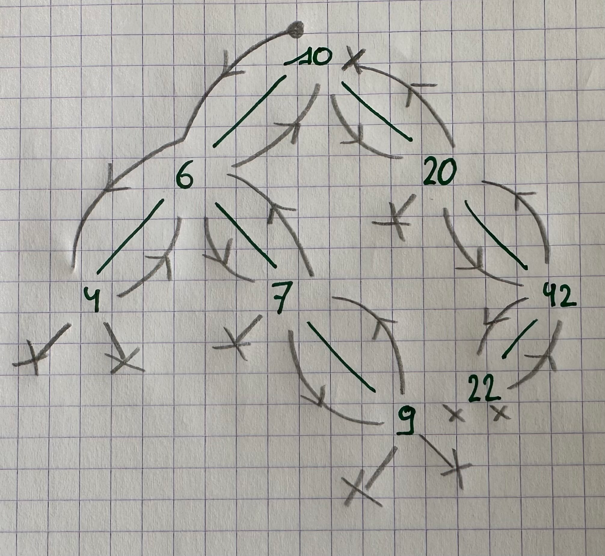
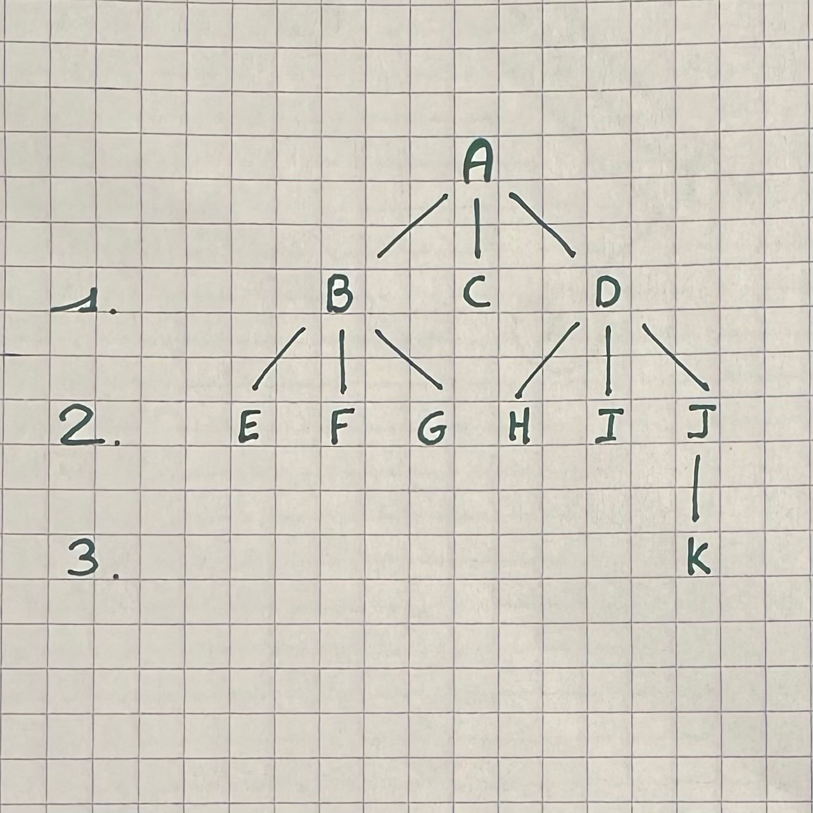
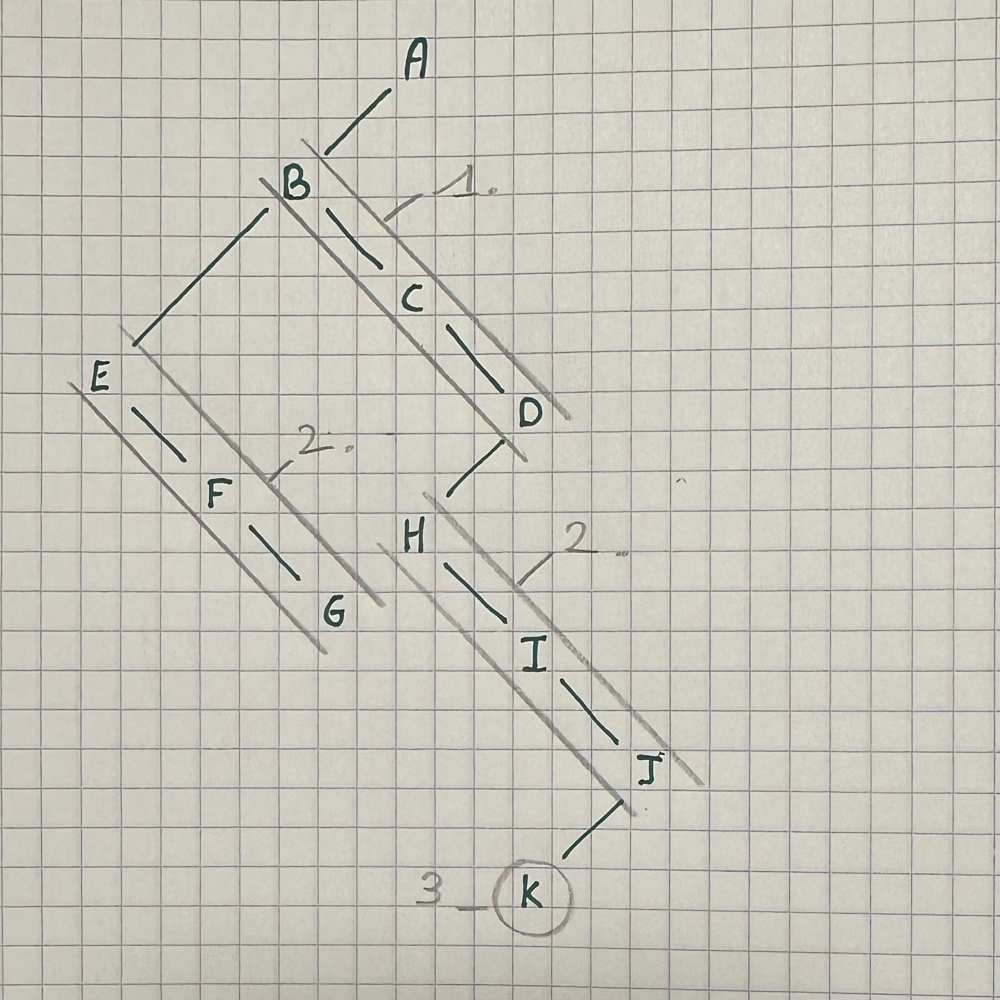

# Structure en arbre

- est une "Structure de données"

### Composition:

- Noeuds: Élément de l'arbre (valeur + références vers d'autres noeuds)

- **Racine: Premier Noeud**

- **Feuilles: Dernier Noeud (pas de références vers d'autres noeuds)**

### Relation entre noeuds:
- Enfant: Est référencé dans un autre noeud dit "parent"
- Parent: Fait référence à des noeuds dits "Enfant"
- **Frère: Ils ont le même parent**

### Profondeur vs Hauteur ???

- Profondeur: Distance entre un noeud et la racine.
- Hauteur: Profondeur maximale d'un arbre

### Arbres binaires

- Arbres où les noeuds ne peuvent pas avoir plus de deux enfants.

### Parcours

1. Si je peux aller à **Gauche**, je le fais.
2. Sinon si je peux aller à **Droite**, je le fais.
3. Sinon je remonte d'un noeud.
4. Fini, quand on est au noeud racine sans pouvoir bouger.

> |!| Je ne peux pas aller à droite ou à gauche, si je l'ai déjà fait sur ce même noeud. |!|

### Parcours en Préfixe

Je note le noeud seulement si:
- je ne l'ai jamais vu auparavant.

> Exemple du dessus: 10, 6, 4, 7, 9, 20, 42, 22

### Parcours en Infixe

Je note le noeud seulement si:
- je ne peux plus descendre à gauche
- je ne note pas 2 fois le même noeud.

> Exemple du dessus: 4, 6, 7, 9, 10, 20, 22, 42

### Parcours en Postfixe

Je note le noeud seulement si:
- je ne peux plus descendre du tout / je dois remonter

> Exemple du dessus: 4, 9, 7, 6, 22, 42, 20, 10

### Parcours en largeur

> |!| Pas la même méthode que Préfixe / Infixe / Postfixe |!|

- Ligne par ligne, de gauche à droite
- On note chaque nouveau noeud sur le chemin.

### Ajout

1. On démarre de la racine
2. Si la nouvelle valeur est plus grande que le noeud courant, on va à droite
3. Sinon, à gauche
4. S'il n'y a pas de noeud là où l'on souhaite aller, on en crée un avec notre valeur

### Recherche

1. On démarre de la racine
2. Si notre valeur est plus grande que celle du noeud courant, on va à droite
3. Sinon, à gauche
4. S'il n'y a pas de noeud là où l'on souhaite aller, la valeur n'existe pas.

### Suppression

1. Si l'élément est une feuille, on peut le supprimer
2. Sinon, on retire l'élément actuel, puis on prend le plus grand des éléments à sa gauche
3. S'il n'a pas de gauche, on prend le plus petit des éléments à sa droite.
4. Si l'élément pris pour faire l'étape 2/3 n'est pas une feuille, refaire cet algorithme de suppression à l'emplacement où était l'élément

### Arbres n-aires -> Binaires

1. On commence à la racine
2. On prend l'enfant le plus à gauche.
3. Tous les autres enfants du noeud actuel vont les uns à la suite des autres à droite de l'enfant de gauche.
4. On le fait pour tous les noeuds, étage après étage.

---
Synthèse par Colle Joulian