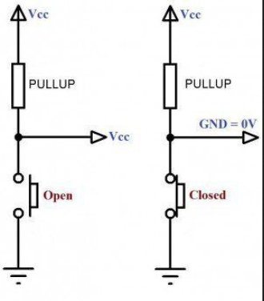
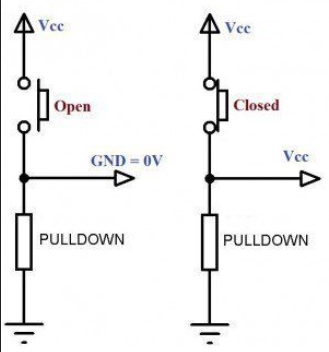

# Prise de note - arduino - N{xx}

## Exo

- Pull-up + Pull-down + Potentiometre + Joystick (x,y)
```cpp
int BTN = 3;
int BTN2 = 4;
int POT = A5;
int JoystickX = A2;
int JoystickY = A1;

int valueBTN;
int valueBTN2;
int valuePOT;
int valueJoystickX;
int valueJoystickY;

int LED = 13;
int LED2 = 12;
 
void setup() {
  Serial.begin(9600);
  pinMode(BTN, INPUT);
  pinMode(BTN2, INPUT);
  pinMode(POT, INPUT);
  pinMode(JoystickX, INPUT);
  pinMode(JoystickY, INPUT);
  pinMode(LED, OUTPUT);
  pinMode(LED2, OUTPUT);
}

void loop() {
  valueBTN = digitalRead(BTN);
  if (valueBTN == HIGH) {
    digitalWrite(LED, LOW);
  } else {
    digitalWrite(LED, HIGH);
  }

  valueBTN2 = digitalRead(BTN2);
  if (valueBTN2 == HIGH) {
    digitalWrite(LED2, HIGH);
  } else {
    digitalWrite(LED2, LOW);
  }

  valuePOT = analogRead(POT);
  Serial.print("POT value: ");
  Serial.print(valuePOT);

  Serial.print(", ");

  valueJoystickX = analogRead(JoystickX);
  Serial.print("X: ");
  Serial.print(valueJoystickX);

  Serial.print(", ");

  valueJoystickY = analogRead(JoystickY);
  Serial.print("Y: ");
  Serial.print(valueJoystickY);

  Serial.println(".");
}
```

## Theorie

### Pull-up

- Resistance entre le 5v/3.3v au boutton (vers le haut)



### Pull-down

- Resistance entre le 0v et le boutton (vers le bas)



### Utiliser le moniteur serie

1. Initialisation du moniteur. (9600, c'est le nombres de ticks du moniteur serie.)
```cpp
void setup() {
    Serial.begin(9600)
}
```

2. Ecrire un message dans la console.
```cpp
void loop() {
    Serial.print("Hello World!") // SANS RETOUR A LA LIGNE
    Serial.println("Hello World!") // AVEC RETOUR A LA LIGNE
}
```

3. Upload le code sur la board.

4. Lancer le moniteur serie. (ctrl + shift + M)

## Notice

> Ces notes ne sont pas forcement correctes (voir syntheses).